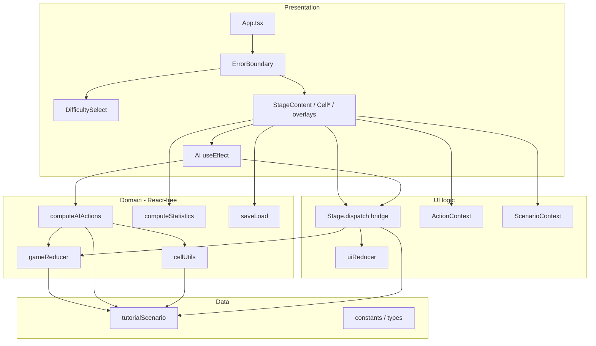
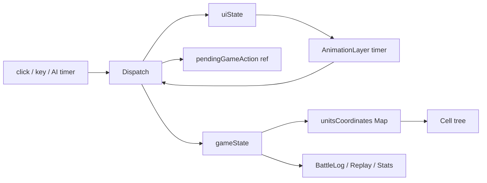
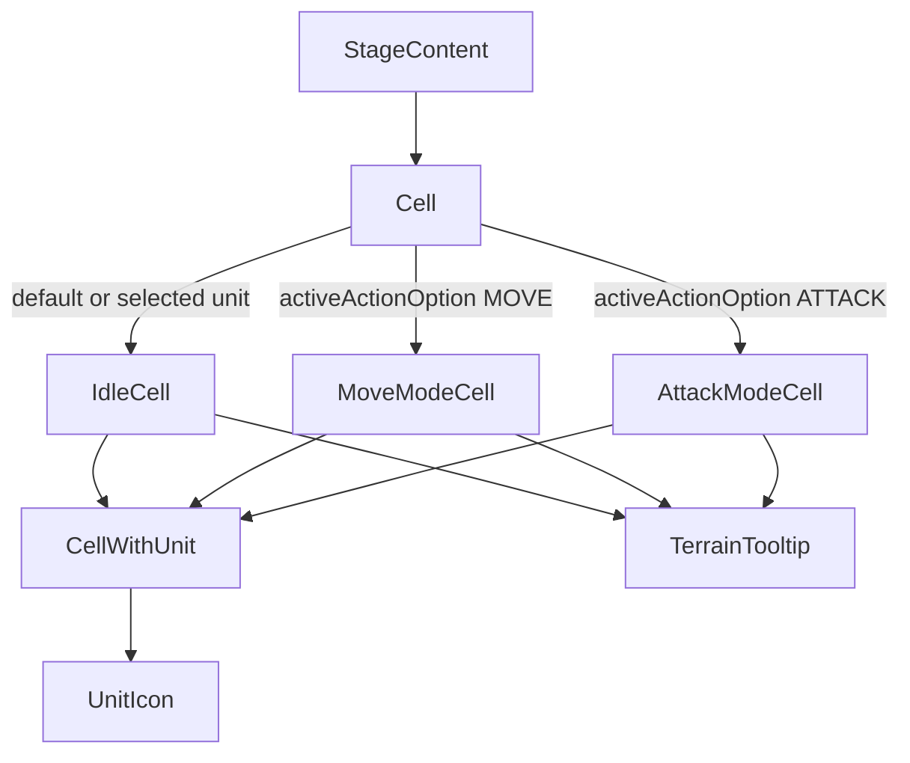

# アーキテクチャ概要

| 項目 | 値 |
|------|-----|
| 文書タイトル | アーキテクチャ概要 |
| Author | Engineering |
| Date | 2026-08-28 |
| Status | Approved |
| 対象リポジトリ | `war-sim-game` |
| 正本 | [as-built-design.md](./as-built-design.md) |
| 関連 | [機能要件](./functional-requirements.md) · [概要設計](./overview-design.md) · [アーキテクチャ](./architecture.md) |

本ドキュメントは現行ソースに基づく as-built 記述である。未実装機能は提案しない。

## 1. Overview

本システムは、ブラウザ上で動作するターン制の戦争シミュレーションゲームである。プレイヤー1（Hero, `id: 1`）が人間、プレイヤー2（Villan, `id: 2`, 定数 `AI_PLAYER_ID`）が AI として、13×10 グリッド上の軍事ユニットを操作し、相手の全ユニットを撃破した側が勝利する。

実装は React 18 + TypeScript strict + Vite の単一 SPA である。ゲームルールは React 非依存の純粋関数 `gameReducer`（`src/game/gameReducer.ts`）に閉じ、UI 状態は `uiReducer`（`src/pages/Stage/logics.ts`）が管理する。`src/pages/Stage/index.tsx` の `dispatch` が両 reducer とアニメーションを橋渡しする Two-Reducer パターンが中核である。ルーティングライブラリは使わず、`App.tsx` が難易度選択画面とステージ画面をローカル state で切り替える。

現行の実装済み機能は、移動/攻撃/ターン終了、地形（平地・森林・山岳・水域）、ユニット特殊能力、AI 3 難易度、セーブ/ロード（localStorage 単一スロット）、バトルログ、テキストリプレイ、戦績統計、キーボード操作、Error Boundary、GitHub Actions CI である。シナリオは `tutorialScenario` 1 本のみで、ゲームロジック層はこれを直接 import している。AI ターンのポインタロック、統計の `UNDO_MOVE` 再生、移動 BFS のユニット壁判定は部分実装または未保証である。

---


## 5. アーキテクチャ概要

### 5.1 レイヤリング



依存の方向は概ね UI → domain → data。

- AI 呼び出しは `StageContent` の `useEffect`（図の `AIfx`）→ `computeAIActions` → 戻り値を `dispatch`。`dispatch` は AI を import しない。
- `Dispatch --> Tut` は攻撃プレビュー地形と `nextPlayer` 用の `tutorialScenario` import であり、シナリオへルールを「送る」エッジではない。シングルトン結合の本体は `GR --> Tut` / `AI --> Tut` / `CU --> Tut`。
- `ai.ts` が `src/pages/Stage/cellUtils.ts` を import する（domain → UI 配下）。移動 BFS がページモジュールに置かれているため。
- `ScenarioContext` は描画専用で、ルール計算の単一ソースではない。

### 5.2 Two-Reducer と dispatch ブリッジ

`Stage` は `useReducer(gameReducer, loadedState ?? initialGameState)` と `useReducer(uiReducer, INITIAL_ACTION_MENU)` を並列に持つ。統一型 `DispatchAction`（`src/types/index.ts`）を `ActionContext.dispatch` として公開する。

| `DispatchAction.type` | 処理 |
|----------------------|------|
| `OPEN_MENU` | 自軍なら `uiDispatch OPEN_MENU`。敵なら `INSPECT_UNIT` |
| `CLOSE_MENU` | `uiDispatch CLOSE_MENU` |
| `SELECT_MOVE` / `SELECT_ATTACK` | 自軍チェック後 `uiDispatch` |
| `DO_MOVE` / `DO_ATTACK` / `TURN_END` | アニメ開始 + `pendingGameAction`。reducer 適用は `ANIMATION_COMPLETE` まで遅延 |
| `UNDO_MOVE` | 即 `gameDispatch` + `uiDispatch RESET`（アニメ idle なので RESET は効く） |
| `ANIMATION_COMPLETE` | pending を `gameDispatch`。続けて `uiDispatch ANIMATION_COMPLETE`。MOVE/ATTACK なら適用**前**の `gameState` で残行動を判定し OPEN_MENU。TURN_END 時の `uiDispatch RESET` は **デッドコード**: RESET を `ANIMATION_COMPLETE` より先に送るが、この時点の `animationState` はまだ `turn_change` のため `uiReducer` が無視する |

`animationState.type !== "idle"` かつ `ANIMATION_COMPLETE` 以外は `dispatch` が no-op。`uiReducer` も同様。ターン切替のメニュー閉じは `ANIMATION_START_TURN_CHANGE`（`isOpen` / `targetUnitId` / `activeActionOption` / `selectedArmamentIdx` をクリア、`...state` のため `cursorPosition` は残る）。`ANIMATION_COMPLETE` は `animationState` を idle にするだけ。残留カーソルがあると次ターンの Enter はセル操作になり、TURN_END にならない（FR-085）。

`uiDispatch` も Context に露出する（キーボードの `MOVE_CURSOR` / `CLEAR_CURSOR`）。INSPECT は `dispatch(OPEN_MENU)` 経由。

`GameAction` はドメイン専用:

```ts
| { type: "DO_MOVE"; unitId; payload: PayloadMoveActionType }
| { type: "DO_ATTACK"; unitId; payload: PayloadAttackActionType }
| { type: "TURN_END" }
| { type: "UNDO_MOVE"; unitId }
| { type: "LOAD_STATE"; state: GameState }
```

`UIAction` はメニュー・アニメ・カーソル専用。ゲームルールを変えない。

### 5.3 データフロー



一方向。`gameState.units` が盤面の正。グリッドは `x${x}y${y}` → `unit.spec.id`。移動アニメ中はそのユニットをグリッドから外し、`AnimationLayer` が描く。

### 5.4 Cell コンポーネント階層



`Cell` は `React.memo`。ただし `useContext(ActionContext)` のため、Context value が変わるたびに全セル（130）が再レンダーされる（既知、`IMPROVEMENT_PLAN.md` T4）。

カーソル位置のセルは `.cell-cursor-wrapper` で包む。

### 5.5 永続化

- キー: `war-sim-save`
- スキーマ version はリテラル `1`。不一致は `loadGame() === null`
- 破損 JSON は catch して `null`
- ロードは `LOAD_STATE` を dispatch せず、`useReducer` の初期引数に `loadedState` を渡す
- `history` も GameState の一部として保存されるため、ロード後もログ・リプレイ・統計が復元される
- 難易度も保存する。盤面と AI 強度の不整合を避ける

セキュリティ上、セーブは信頼できるローカルデータとしてパースするのみで、スキーマの実行時検証（units 形状など）はない。

### 5.6 テスト戦略

| 層 | ファイル | 内容 |
|----|----------|------|
| ドメイン単体 | `gameReducer.test.ts`（67） | 向き、プレイヤー巡回、ダメージ、能力、移動境界、攻撃、Undo、TURN_END、勝敗、地形、history |
| AI 単体 | `ai.test.ts`（15） | 接近、武装選択、EN、占有目的地、難易度、複数ユニット順 |
| 統計単体 | `statistics.test.ts`（6） | 与ダメ、キル、MVP、TURN_END 後の強襲リセット。`UNDO_MOVE` 後攻撃のケースなし |
| UI reducer | `logics.test.ts`（15） | メニュー、アニメ遮断、INSPECT_UNIT |
| コンポーネント | `Stage.test.tsx`（4） | フル tutorial グリッドでメニュー・移動・攻撃・手番切替 |
| 勝敗 E2E 相当 | `StageWin.test.tsx`（1） | `tutorialScenario` を 3×3 に mock し、撃破 → 確定 → overlay |

共通規約:

- `vi.mock("./UnitIcon")`（画像 import を jsdom から隔離。コメントは古い SVG 事情を残す）
- `StageWin` は `vi.mock("../../scenarios/tutorial")` で最小盤
- アニメは fake timers + `MOVE_DURATION` / `ATTACK_DURATION` / `TURN_CHANGE_DURATION`
- `cellUtils.getReachableCells` と `saveLoad.ts` に専用テストはない
- `computeStatistics` は `UNDO_MOVE` をシミュレートせず、ReplayViewer（`gameReducer` 再実行）と契約が違う

CI: Node `.node-version` = `24.13.1`、`yarn install --frozen-lockfile`。

### 5.7 技術スタック

| 項目 | 実装 |
|------|------|
| UI | React 18.2, `react-dom` |
| 言語 | TypeScript 5.0 strict |
| バンドル | Vite 4.4 + `@vitejs/plugin-react` |
| スタイル | Sass（`Stage.scss` 1266 行が主、`DifficultySelect` / `GameOverOverlay` / `ReplayViewer` は分離） |
| SVG プラグイン | `vite-plugin-svgr` は `vite.config.ts` に残るが、ユニット画像は JPG |
| テスト | Vitest 4, jsdom, Testing Library, `@testing-library/jest-dom/vitest` |
| 本番依存 | `react`, `react-dom` のみ |
| 状態 | `useReducer` ×2 + Context。Redux/Zustand なし |
| 通信 | なし（完全クライアント） |

### 5.8 ディレクトリマップ

```
src/
├── main.tsx                      # StrictMode + App
├── App.tsx                       # ErrorBoundary + DifficultySelect | Stage
├── index.css                     # テーマ CSS 変数
├── components/ErrorBoundary.tsx
├── constants/index.ts            # 武装, UNIT_ABILITIES, AI_PLAYER_ID, playerColor
├── contexts/ScenarioContext.tsx
├── game/
│   ├── types.ts                  # GameState / GameAction / GamePhase
│   ├── gameReducer.ts            # ルール
│   ├── ai.ts                     # AI
│   ├── saveLoad.ts
│   ├── statistics.ts
│   └── utils.ts
├── pages/Stage/                  # ゲーム画面一式
├── scenarios/tutorial.ts         # 唯一のシナリオ
├── types/index.ts, scenario.ts
├── assets/*.jpg
└── test/setup.ts
```

`pages/` 配下は `Stage` のみ。マルチページ構造ではない。

### 5.9 既知の結合と不変条件の所在

| 結合 | 内容 | 影響 |
|------|------|------|
| `tutorialScenario` 直接参照 | `gameReducer.ts`, `ai.ts`, `cellUtils.ts`, `Stage/index.tsx` | 第二シナリオを足してもルールが tutorial の grid/terrain/players を見る。`IMPROVEMENT_PLAN.md` T2 |
| `ScenarioContext` の二重管理 | UI は Context、ルールは import | テストで scenario を mock しても reducer は本物の tutorial 地形を使う（`StageWin` はコンポーネント層のみ mock） |
| `AI_PLAYER_ID = 2` | Stage と TurnBanner と constants | 人間を Villain 側にできない |
| 射程・占有は UI/AI | reducer は境界・water・手番・EN | キーボード Enter 移動は範囲外/占有へ `DO_MOVE` し得る。占有時は `unitsCoordinates` が throw |
| 移動 BFS はユニット非考慮 | `getReachableCells` は地形と境界のみ。`MoveModeCell` は目的地占有だけ拒否 | 味方/敵スタックを「通過」して空マスへ着地できる。AI も同じ BFS + 着地セルの `occupiedCells` のみ |
| AI ターンの入力ロック不完全 | キーボードと「確定」のみ。`dispatch` は `AI_PLAYER_ID` 非検査 | idle ギャップで人間が AI ユニットを操作し、計画キューと盤面がずれる（FR-066） |
| TURN_END 時 UI RESET デッド | RESET を `ANIMATION_COMPLETE` より前に送り、`uiReducer` がアニメ中に無視 | メニュー閉じは `ANIMATION_START_TURN_CHANGE`。`cursorPosition` が次ターンへ漏れる |
| `initialCoordinate` 非更新 | Undo はスポーンへ戻る | 2 ターン目以降の Undo がターン開始位置にならない |
| `history` 無制限 + no-op 追記 | 全 GameAction を保持。units 不変の DO_MOVE/DO_ATTACK も append | 長期戦でメモリ増（T8）。BattleLog が偽の移動/攻撃を出す。統計は no-op 攻撃を与ダメに数え得る |
| `ActionContext` 巨大 value | gameState + uiState + dispatch + uiDispatch + difficulty + onRestart | Cell memo 無効化（T4） |
| `dispatch` 約 100 行 | アニメ・権限・メニュー再開が 1 関数 | T5 |
| domain → `cellUtils` | AI が pages 配下の BFS に依存 | 層の逆転 |

ゲームロジックの実際の不変条件（reducer が保証するもの）:

- 手番外ユニットは動かせない / 攻撃できない / Undo できない
- 盤外・水域への移動は units を変えない **が history には残る**
- EN 不足の攻撃は units を変えない **が history には残る**
- 終了後は `LOAD_STATE` 以外 no-op（history も増えない）
- 攻撃は決定論的 `calculateDamage`

UI が追加で保証しようとするが reducer が保証しないもの: 移動射程、地形コスト、経路/目的地の占有、攻撃射程、敵味方、1 ターン 1 移動/1 攻撃。

UI のみの移動慣例: 到達セル = 地形 BFS（ユニット非壁）。空マスだけ `.cell-move-range`。着地占有は通常セル表示のままクリック拒否。経路通過は可。

---


## 6. Alternatives Considered

現行 Two-Reducer + Vite SPA に対する、採用し得た（または部分的に検討された）代替。

### Alternative A: 単一 reducer（Game + UI 混在）

初期の小さなゲームが取りがちな形。`useReducer` 1 つに `OPEN_MENU` と `DO_MOVE` を同居させる。

| | 現行 Two-Reducer | 単一 reducer |
|--|------------------|--------------|
| テスト | React 非依存のドメインテスト 88 件（`gameReducer.test.ts` 67 + `ai.test.ts` 15 + `statistics.test.ts` 6）。全体 108 | UI フィールドがテストフィクスチャを汚染 |
| 勝敗・Replay / Stats | ReplayViewer は `gameReducer` を history に再適用する。AI は `calculateDamage` と `getReachableCells` を呼ぶ。Stats（`computeStatistics`）は `calculateDamage` + 独自シャドウで、`gameReducer` も `UNDO_MOVE` も使わない（FR-076） | リプレイがメニュー状態まで再生対象になる |
| 複雑度 | dispatch ブリッジが必須 | ブリッジは不要だが action 型が膨張 |
| 判定 | **現行採用**。`gameReducer` の React 非依存は ReplayViewer の前提。Stats が共有するのはダメージ式（`calculateDamage`）だけであり、reducer 再実行クライアントではない |

### Alternative B: Redux Toolkit / Zustand 等の外部ストア

| | 現行 | 外部ストア |
|--|------|------------|
| 依存 | 本番 2 パッケージ | 追加ランタイム |
| DevTools | なし | time-travel が容易 |
| 分割 | ファイル分割 + Context | slice / store 分割 |
| 規模 | 単一画面・単一シナリオ | 現状オーバースペック |

クライアント完結・状態寿命 = 1 セッション（セーブは JSON スナップショット）のため、React 標準 `useReducer` で十分。導入コストに見合うクロス画面ストアはない。

### Alternative C: ゲームループをクラス / ECS にする

| | 現行 | クラス/ECS |
|--|------|------------|
| 再現性 | 決定論的 reducer + history | ミューテーション追跡が必要 |
| リプレイ | history を reducer に再適用 | コマンドログかスナップショット列が別途必要 |
| 学習コスト | フロントエンド標準 | ゲームエンジン的モデル |

ターン制・完全情報・乱数なしなので、フレームループや ECS は過剰。`history: GameAction[]` がリプレイの正本（`gameReducer` 再実行）である点が reducer 採用の根拠。統計は同じ history を読むが独自シャドウであり、`UNDO_MOVE` でリプレイと乖離する（FR-076）。

### Alternative D: マルチページ or SSR

難易度選択とステージを React Router / フレームワークに分ける案。

現状は `difficulty === null` の条件分岐のみ。URL 共有・OGP・認証がないため Vite SPA が最小。Cloudflare Pages の静的ホスティングとも一致する。

---


## 7. Security & Privacy Considerations

本アプリはサーバを持たない静的フロントエンドである。脅威は限定的だが、次を前提とする。

| 脅威 | 深刻度 | 現状 | 緩和 |
|------|--------|------|------|
| localStorage セーブの改ざん | 低（単体ゲーム） | `JSON.parse` 後 `version !== 1` のみ拒否。`GameState` の構造検証なし | チートはローカル限定。将来オンライン化するならサーバ権威が必須 |
| XSS | 低 | ユーザー生成 HTML なし。ユニット名はシナリオ定数 | React のテキスト挿入。`dangerouslySetInnerHTML` なし |
| 依存脆弱性 | 中 | 本番は react / react-dom のみ | lockfile + CI frozen install。Vite 4 / ESLint 8 は既知の古いメジャー |
| プライバシー | なしに等しい | セーブは端末内。テレメトリ・cookie・認証なし | 個人データ処理なし |
| セーブキー衝突 | 低 | 固定キー `war-sim-save` | 同一オリジンの他アプリと衝突し得るが専用 Pages デプロイ |

認可モデルはない。AI 難易度もクライアント側。対戦の公正性は「ローカル PvE」の範囲でのみ意味を持つ。

---


## 8. Observability

本番オブザーバビリティは未導入である。

| 領域 | 現状 |
|------|------|
| ログ | `console` ベースの運用ログなし。開発時の React StrictMode のみ |
| メトリクス | なし。RUM / エラー収集なし |
| アラート | なし |
| ユーザー向け障害 | `ErrorBoundary` が `error.message` を `<pre>` 表示し「再試行」で `hasError` を戻す。componentDidCatch でのリモート送信なし |
| デバッグ手段 | `history` 配列、BattleLog、ReplayViewer が事実上のゲームトレース |
| 品質ゲート | CI の lint / `tsc` / vitest。カバレッジ計測（`@vitest/coverage-v8`）は未設定 |

将来メトリクスを足すなら、クライアント完結なので「ゲーム開始数・勝敗・平均ターン・セーブ成功/失敗」程度が妥当。現状コードにフック点はない。

---


## 9. Risks

| ID | リスク | 深刻度 | 現状の現れ | 緩和 |
|----|--------|--------|------------|------|
| R1 | シナリオ追加不能 | 高 | ルール層が `tutorialScenario` 固定 | T2: grid/players/terrain を引数化。本ドキュメントのアーキテクチャ上最大のブロッカー |
| R2 | reducer と UI のルール不一致 | 高 | キーボード移動が射程外・占有マスを reducer が受け入れ、占有時は描画 throw。BFS はユニットを壁にしない | 移動/攻撃の妥当性（射程・占有・通過）を `gameReducer` に集約 |
| R3 | Undo がスポーンへ戻る | 中 | `initialCoordinate` が TURN_END で更新されない | ターン開始時に `initialCoordinate = coordinate` |
| R4 | history 無制限成長 + no-op 追記 | 中 | 全操作を配列保持。units 不変の DO_MOVE/ATTACK も append。セーブ JSON も肥大 | 上限 or ターン単位圧縮（T8）。units 参照が変わったときだけ append |
| R5 | 130 セルの Context 再レンダー | 中 | `ActionContext` が game+ui を同居 | Context 分割 or selector（T4） |
| R6 | 味方攻撃が可能 | 低 | `AttackModeCell` / キーボードが `playerId` を見ない | UI と reducer の両方で敵のみ許可 |
| R7 | セーブスキーマ非検証 | 低 | 手動改ざんや将来フィールド追加で実行時例外 | ロード時の型ガード |
| R8 | AI 計画の一括スナップショット + ポインタ未ロック | 中 | 計画はターン開始盤面。idle 500ms 中に人間が AI ユニットを操作できる（FR-066）。採点は未移動でも強襲込み | AI ターン中は `dispatch` を `AI_PLAYER_ID` で拒否するかグリッドを `pointer-events: none`。採点は実際に move を積んだときだけ `moved: true` |
| R8b | 統計とリプレイの乖離 | 中 | `computeStatistics` が `UNDO_MOVE` / no-op 攻撃を正しく扱わない | シャドウ再生を `gameReducer` に寄せるか `UNDO_MOVE` 分岐を追加。undo-then-attack のテストを足す |
| R9 | ツールチェーン老化 | 中 | Vite 4, ESLint 8 EOL（計画 DX4/DX7） | ドキュメント PR の範囲外。後続 chore |
| R10 | README / CLAUDE.md の陳腐化 | 低 | README は人間 2 人対戦を示唆し、戦闘機 HP を 800-1000、`ActionMenu.tsx` と SVG を残す。コードは PvE・fighter HP 1000・`ActionButtons.tsx`・JPG | PR-2 / PR-3 で追従 |

---


## 10. Key Decisions

現行コードに既に埋め込まれている決定。新規提案ではない。

1. **Two-Reducer 分離** — `gameReducer.ts`（React 非依存）と `logics.ts`（UI）。根拠: ReplayViewer が `gameReducer` を再実行できる。統計は history の独自シャドウ再生（`UNDO_MOVE` 非対応でリプレイと完全一致はしない）。UI フラグを混ぜるとどちらも不可能。橋は `Stage/index.tsx` `dispatch`。

2. **勝敗は TURN_END のみ** — `DO_ATTACK` で最後の敵を消しても `phase` は `playing`。根拠: 攻撃後の残移動、ターン切替アニメ、オーバーレイの順序を単一イベントに畳む。テスト `does not transition to finished during DO_ATTACK` が契約。

3. **決定論的戦闘** — 命中率も乱数もない。`calculateDamage` が唯一のダメージ関数。根拠: AI・プレビュー・統計・リプレイが同一式を共有できる。Into the Breach 型の完全情報。

4. **シナリオはデータだが実行時はシングルトン** — `Scenario` 型と `ScenarioContext` はある。しかしルールは `import { tutorialScenario }`。根拠: 単一マップでの出荷を優先。マルチシナリオの最大ブロッカーとして認識済み（T2）。

5. **AI はクライアントの計画関数** — サーバも WebWorker もない。`computeAIActions` が `AIAction[]` を返し、UI が人間と同じ `dispatch` で再生。根拠: ルール再利用とアニメ再利用。難易度はスコア関数の分岐のみ。

6. **永続化は GameState スナップショット** — 操作ログ再生ではなく JSON 丸ごと。`LOAD_STATE` は用意するが UI は reducer 初期値注入。根拠: 実装最小。history がスナップショットに含まれるためログも復元される。

7. **アニメは UI 状態機械** — ゲーム状態の適用を `pendingGameAction` + `ANIMATION_COMPLETE` で遅延。根拠: 移動中ユニットをグリッドから外してマーカーを動かすため、適用をビジュアル完了後にずらす。`prefers-reduced-motion` で遅延 0。

8. **Cell モード分割** — `IdleCell` / `MoveModeCell` / `AttackModeCell`。根拠: ハイライトとクリック意味がモードで全く違う。`Cell.tsx` は振り分けのみ。

9. **人間=P1, AI=P2 固定** — `AI_PLAYER_ID`。根拠: PvE 専用として完成させた。F7（人間同士）は未着手。

10. **武装・能力はカテゴリテーブル** — `getAraments(unitType)`, `UNIT_ABILITIES[unitType]`。カテゴリで HP / `max_en` / 武装が決まる（fighter 1000/200、tank 2000/400、soldier 200/100）。個体差は `name` と `movement_range`。fighter の range は Hero・Villain とも 2–4（`VF-25F/G/S` および Hero 4 機）。Hero fighter 4 機の name はいずれも `"VF-171"`。

11. **座標はマンハッタン、移動だけ地形コスト** — 攻撃は飛び越し。水域は移動不可・防御 0。根拠: `isWithinRange` vs `getReachableCells` の分離。

12. **本番依存最小** — React 以外のランタイムライブラリを置かない。状態・AI・セーブは自前。

---


## 11. Open Questions

プロダクト未決定ではなく、as-built 上「コードが黙っている」または計画上未着手の論点。

1. `UNDO_MOVE` → `initialCoordinate`（スポーン）は仕様かバグか。テストは同一ターンのスポーン復帰のみカバー。
2. 味方攻撃を許可するか。UI も reducer も禁止していない。
3. キーボード移動のバリデーションをマウスクリックと揃えるか。マウス到達判定も経路上ユニットを壁にしない現状を維持するか。
4. `LOAD_STATE` を SemVer 付きの正式ロード経路にするか、初期引数注入のままか。
5. `deleteSave` を UI に出すか。上書き保存のみで運用している。
6. 第二シナリオを足す前に T2（tutorial 参照排除）を必須とするか。現状は必須。
7. Player 2 表示名 `Villan` を `Villain` に直すか（テスト `Stage.test.tsx` が `"Villan"` を期待）。
8. `vite-plugin-svgr` を残すか。ユニットは JPG。
9. カバレッジしきい値を CI に入れるか。`cellUtils` / `saveLoad` が未テスト。`computeStatistics` の undo-then-attack も未カバー。
10. `IMPROVEMENT_PLAN.md` 記載のテスト件数 79 は現行 108 と不一致。計画書の現状評価をいつ更新するか。
11. AI ターン中のポインタをロックするか。現状はキーボードと「確定」のみ（FR-066）。
12. `computeStatistics` を `gameReducer` 再実行に寄せるか、`UNDO_MOVE` 分岐を足すか。現状はリプレイと契約が違う。
13. no-op の `DO_MOVE` / `DO_ATTACK` を history に残すか。units 参照変化時のみ append するか。
14. ターン切替後の `cursorPosition` リークを消すか。RESET を idle 後に送るか、`ANIMATION_COMPLETE` で `INITIAL_ACTION_MENU` に戻すか。

---


## 12. References

### リポジトリドキュメント

- [README.md](README.md) — セットアップ、コマンド、旧寄りの構成図
- [CLAUDE.md](CLAUDE.md) — エージェント向けアーキテクチャ要約（SVG、ファイル一覧が部分的に古い）
- [CLAUDE.local.md](CLAUDE.local.md) — ローカルタスクファイル規約（本ドキュメントの git 配置とは別）
- [IMPROVEMENT_PLAN.md](IMPROVEMENT_PLAN.md) — 完了済み機能と残存バックログ（最終更新 2026-02-19）

### 中核ソース

- `src/types/index.ts` — `DispatchAction`, `UnitType`, `AnimationState`, payloads
- `src/types/scenario.ts` — `Scenario`
- `src/game/types.ts` — `GameState`, `GameAction`, `GamePhase`
- `src/game/gameReducer.ts` — ルールと `calculateDamage`
- `src/game/ai.ts` — `computeAIActions`, `AIDifficulty`
- `src/game/saveLoad.ts` — localStorage
- `src/game/statistics.ts` — `computeStatistics`
- `src/game/utils.ts` — `manhattanDistance`
- `src/pages/Stage/index.tsx` — dispatch ブリッジ、AI、キーボード
- `src/pages/Stage/logics.ts` — `uiReducer`
- `src/pages/Stage/cellUtils.ts` — BFS / マンハッタン
- `src/scenarios/tutorial.ts` — 盤面・ユニット・地形
- `src/constants/index.ts` — 武装と能力
- `src/App.tsx`, `src/main.tsx`, `src/contexts/ScenarioContext.tsx`
- `src/components/ErrorBoundary.tsx`
- `.github/workflows/ci.yml`, `vite.config.ts`, `package.json`

### 契約としてのテスト

- `src/game/gameReducer.test.ts`
- `src/game/ai.test.ts`
- `src/game/statistics.test.ts`
- `src/pages/Stage/logics.test.ts`
- `src/pages/Stage/Stage.test.tsx`
- `src/pages/Stage/StageWin.test.tsx`

### 先行作品（計画書が参照。本 as-built の実装根拠ではない）

Fire Emblem（戦闘予測、Undo）、Advance Wars（地形防御）、Into the Breach（決定論・小型グリッド）

---

