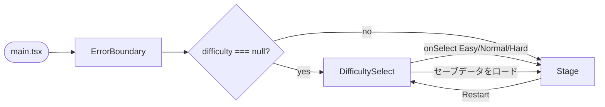
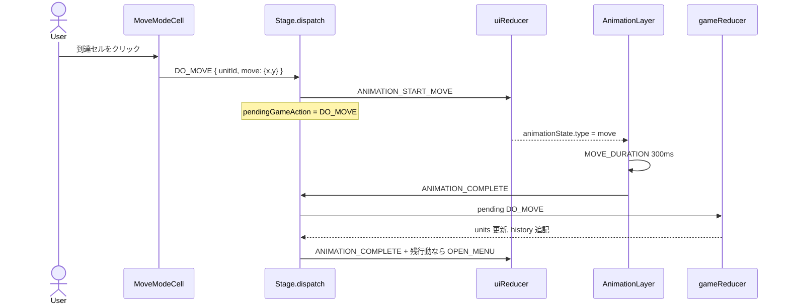
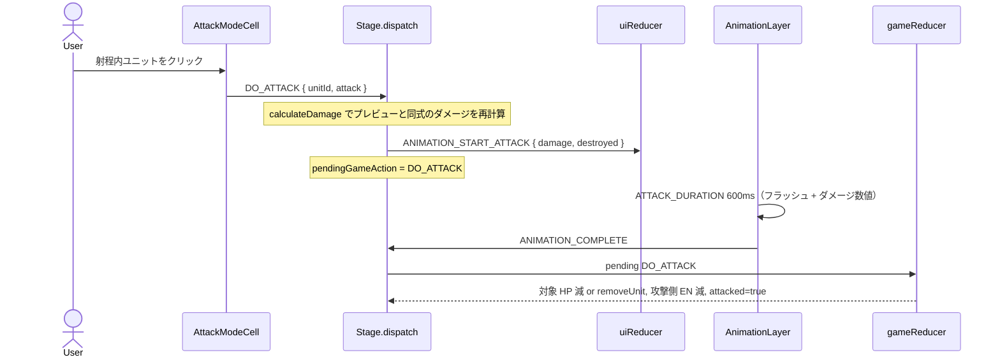
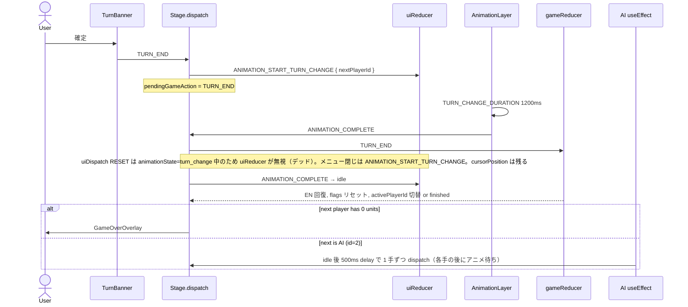
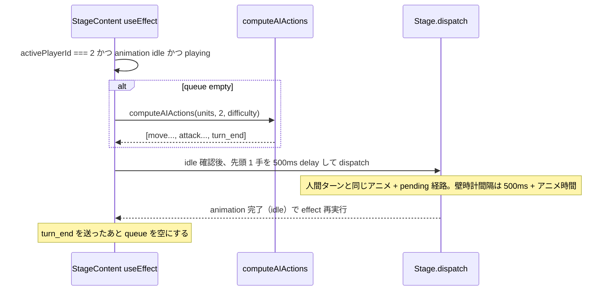
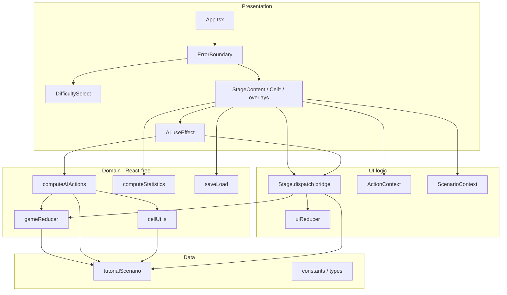
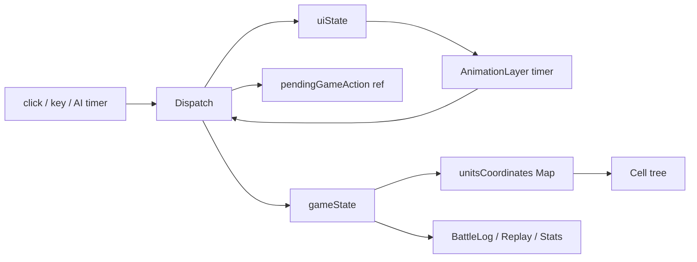
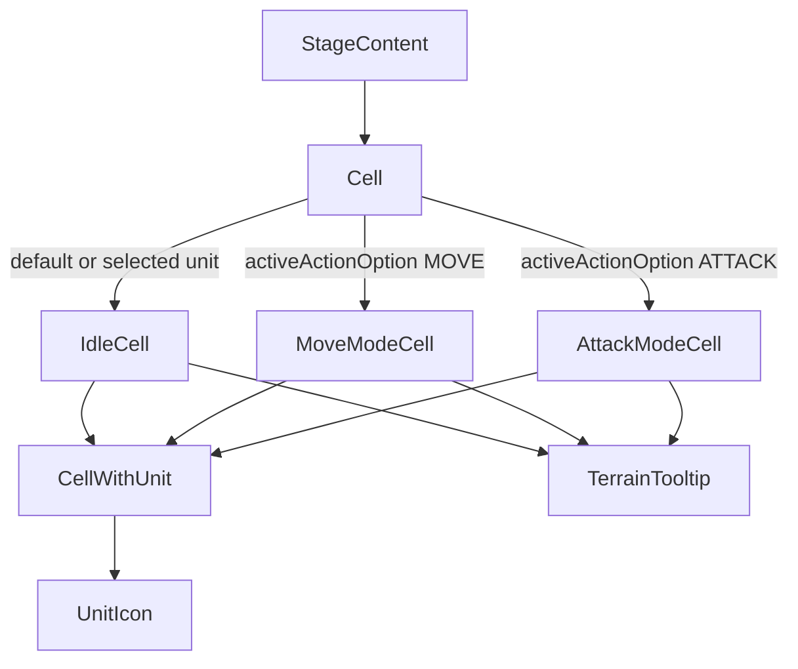

# war-sim-game As-Built 設計ドキュメント

| 項目 | 値 |
|------|-----|
| 文書タイトル | ターン制戦争シミュレーションゲーム As-Built 設計 |
| Author | Engineering |
| Date | 2026-08-28 |
| Status | Approved |
| 対象リポジトリ | `war-sim-game` |
| 根拠 | 現行ソースコード（本ドキュメントは新機能提案ではなく、実装済みシステムの記述） |
| 分割版 | [機能要件](./functional-requirements.md) · [概要設計](./overview-design.md) · [アーキテクチャ](./architecture.md) |

---

## 1. Overview

本システムは、ブラウザ上で動作するターン制の戦争シミュレーションゲームである。プレイヤー1（Hero, `id: 1`）が人間、プレイヤー2（Villan, `id: 2`, 定数 `AI_PLAYER_ID`）が AI として、13×10 グリッド上の軍事ユニットを操作し、相手の全ユニットを撃破した側が勝利する。

実装は React 18 + TypeScript strict + Vite の単一 SPA である。ゲームルールは React 非依存の純粋関数 `gameReducer`（`src/game/gameReducer.ts`）に閉じ、UI 状態は `uiReducer`（`src/pages/Stage/logics.ts`）が管理する。`src/pages/Stage/index.tsx` の `dispatch` が両 reducer とアニメーションを橋渡しする Two-Reducer パターンが中核である。ルーティングライブラリは使わず、`App.tsx` が難易度選択画面とステージ画面をローカル state で切り替える。

現行の実装済み機能は、移動/攻撃/ターン終了、地形（平地・森林・山岳・水域）、ユニット特殊能力、AI 3 難易度、セーブ/ロード（localStorage 単一スロット）、バトルログ、テキストリプレイ、戦績統計、キーボード操作、Error Boundary、GitHub Actions CI である。シナリオは `tutorialScenario` 1 本のみで、ゲームロジック層はこれを直接 import している。AI ターンのポインタロック、統計の `UNDO_MOVE` 再生、移動 BFS のユニット壁判定は部分実装または未保証である。

---

## 2. Goals & Non-Goals

### Goals（本ドキュメントの対象）

- 現行コードベースに存在する機能要件を、ファイル・型・アクション単位で記述する。
- ユーザー操作フロー、状態モデル、Two-Reducer のデータフローを、実装どおりに固定する。
- 既知の結合（`tutorialScenario` 直接参照、reducer が射程/占有を検証しない等）を隠さず記録する。

### Non-Goals（対象外）

- 未実装機能の設計（Fog of War、オンライン対戦、マップエディタ、キャンペーン、反撃、複数シナリオ選択、人間同士ローカル対戦など）。`IMPROVEMENT_PLAN.md` の残存項目は Open Questions / 参照に留める。
- ルールエンジンの書き換え、状態管理ライブラリ導入、バックエンド追加。
- 本ドキュメント作成時点でのアプリケーションコード変更。ドキュメントは `docs/` に配置する。

---

## 3. 機能要件

ステータスはソース根拠に基づく。`実装済み` = 本番コードパスが存在する。`部分実装` = 機能の骨格はあるが制約・未配線がある。`未実装` = コード上に本番パスがない。

### 3.1 ゲームセットアップとプレイヤー

| ID | 要件 | ステータス | 根拠 |
|----|------|------------|------|
| FR-001 | ゲームは 2 プレイヤー固定。Player 1 は Hero（青 `rgb[0,0,255]`）、Player 2 は Villan（赤 `rgb[255,0,0]`。シナリオ上の綴りは `Villan`） | 実装済み | `src/scenarios/tutorial.ts` `PLAYERS` |
| FR-002 | 人間は常に Player 1。Player 2 は AI（`AI_PLAYER_ID = 2`） | 実装済み | `src/constants/index.ts`, `Stage/index.tsx` AI `useEffect` |
| FR-003 | 起動時は難易度選択画面。Easy / Normal / Hard（ラベル: 初級 / 中級 / 上級）を選ぶとステージへ遷移する | 実装済み | `App.tsx`, `DifficultySelect.tsx` |
| FR-004 | 人間同士のローカル対戦、オンライン対戦は提供しない | 未実装 | `AI_PLAYER_ID` がハードコード。モード選択なし |
| FR-005 | シナリオ選択 UI はなく、常に `tutorialScenario`（id `"tutorial"`, name `"Tutorial Battle"`）を使用する | 実装済み（単一シナリオ） | `Stage/index.tsx` `ScenarioProvider scenario={tutorialScenario}` |

### 3.2 盤面・地形

| ID | 要件 | ステータス | 根拠 |
|----|------|------------|------|
| FR-010 | グリッドは 13 列 × 10 行。`Coordinate.x` が列、`y` が行（いずれも 0 始まり） | 実装済み | `tutorial.ts` `CELL_NUM_IN_ROW=13`, `ROW_NUM=10` |
| FR-011 | 地形タイプは `plain` / `forest` / `mountain` / `water` | 実装済み | `TerrainType`, `tutorial.ts` `TERRAIN` |
| FR-012 | 移動コスト: plain=1, forest=2, mountain=3, water=Infinity（進入不可） | 実装済み | `cellUtils.ts` `getTerrainMovementCost` |
| FR-013 | 防御補正: plain=0, forest=20%, mountain=40%, water=0。攻撃射程はマンハッタン距離で地形を無視（飛び越し） | 実装済み | `getTerrainDefenseReduction`, `isWithinRange` |
| FR-014 | セルホバーで地形名・DEF・MOVE コストをツールチップ表示する | 実装済み | `TerrainTooltip.tsx`（平地/森林/山岳/水域） |
| FR-015 | 中央帯に森林ストリップ、両翼山岳、中央水域 3 マス `(5,6)(6,6)(7,6)` を配置する | 実装済み | `tutorial.ts` rows 5–6 |

### 3.3 ユニット

| ID | 要件 | ステータス | 根拠 |
|----|------|------------|------|
| FR-020 | ユニット種別は `UnitCategory = "fighter" \| "tank" \| "soldier"` | 実装済み | `src/types/index.ts` |
| FR-021 | 各ユニットは不変 `spec`（id, name, unit_type, movement_range, max_hp, max_en, armaments）と可変 `status`（hp, en, coordinate, previousCoordinate, initialCoordinate, moved, attacked）を持つ | 実装済み | `UnitType` |
| FR-022 | 初期配置: Villain 9 体（fighter 3, tank 2, soldier 4）+ Hero 7 体（fighter 4, tank 1, soldier 2）。合計 16 体 | 実装済み | `tutorial.ts` `INITIAL_UNITS` id 1–16 |
| FR-023 | 武装はカテゴリ共通。fighter: Machine gun (POW 200 / RNG 2 / EN 50), Missile (400 / 3 / 100)。tank: Machine gun (200 / 2 / 75), Cannon (500 / 4 / 150)。soldier: Assault rifle (100 / 2 / 10), Grenade launcher (300 / 2 / 20), Suicide drone (500 / 3 / 75) | 実装済み | `src/constants/index.ts` `getAraments` |
| FR-024 | 特殊能力: fighter「強襲」（移動後攻撃 +20%）、tank「装甲陣地」（隣接味方ユニット防御 +10%）、soldier「迷彩」（森林防御 +20%） | 実装済み | `calculateDamage`, `UNIT_ABILITIES` |
| FR-025 | ユニットアイコンは JPG（`fighter.jpg` / `tank.jpg` / `army.jpg`）を `` で表示する | 実装済み | `UnitIcon.tsx`。SVG は現行未使用 |
| FR-026 | 向きは `calculateOrientation(current, previousCoordinate)` で UP/DOWN/LEFT/RIGHT。同座標時は UP | 実装済み | `gameReducer.ts`, `CellWithUnit.tsx` |
| FR-027 | HP/EN バーをセル上に表示。HP は healthy (>50%) / warning (>25%) / critical | 実装済み | `CellWithUnit.tsx` `hpBarClass` |

### 3.4 ターンフローと行動

| ID | 要件 | ステータス | 根拠 |
|----|------|------------|------|
| FR-030 | ゲームは `activePlayerId = 1`, `turnNumber = 1`, `phase = { type: "playing" }` で開始する | 実装済み | `Stage/index.tsx` `initialGameState` |
| FR-031 | 自ターン中、各ユニットは移動 1 回・攻撃 1 回を独立に実行できる（順不同） | 実装済み | `moved` / `attacked` フラグ。UI はボタン disable、reducer はフラグ再実行を拒否しない |
| FR-032 | 移動到達判定は地形コスト BFS（`getReachableCells`）。ユニットは経路上の障害にならない。UI は**目的地**が占有されているときだけクリックを拒否する（通過は可）。`.cell-move-range` は空の到達セルのみ。reducer は境界と water のみ検査し、射程・占有は見ない | 部分実装 | `cellUtils.ts` は `units` を読まない。`MoveModeCell` は占有到達マスをハイライトせず `CellWithUnit` + `onClick` no-op。占有目的地でも reducer は受理する |
| FR-033 | 攻撃は選択武装の `range`（マンハッタン）内のユニットをクリックして実行。EN 不足の武装は選択不可 | 部分実装 | UI: `AttackModeCell` + EN disable。reducer は EN と手番のみ検査。射程・敵味方は reducer 非検査。UI も敵味方を区別せず、味方への攻撃が可能 |
| FR-034 | ダメージは `floor(armament.value * attackMultiplier * (1 - min(defenseReduction, 0.9)))`。命中率 100%、乱数なし | 実装済み | `calculateDamage`。`MAX_DEFENSE_REDUCTION = 0.9` |
| FR-035 | HP が 0 以下になった対象は `removeUnit` で盤面から削除する。勝敗判定は攻撃時ではなく `TURN_END` | 実装済み | `updateUnitsByAttack`, GamePhase テスト |
| FR-036 | 移動 Undo（ラベル「戻す」）は `moved && !attacked` のとき、`initialCoordinate` へ戻す | 実装済み | `UNDO_MOVE`。`TURN_END` は `initialCoordinate` を更新しないため、ターン開始位置ではなくスポーン位置へ戻る |
| FR-037 | ターン終了（ラベル「確定」）で、手番プレイヤーの EN を `max_en * 0.1` 回復（上限 `max_en`）、全ユニットの `moved`/`attacked` をリセットし、次プレイヤーへ切替 | 実装済み | `gameReducer` `TURN_END` |
| FR-038 | `turnNumber` は Player 1 に手番が戻ったときだけ +1 する | 実装済み | `nextPlayerId === tutorialScenario.players[0].id` |
| FR-039 | アニメーション中は入力を遮断する。移動 300ms、攻撃 600ms、ターン切替 1200ms。`prefers-reduced-motion: reduce` なら 0ms | 実装済み | `AnimationLayer.tsx` |
| FR-040 | 移動/攻撃完了後、そのユニットに残行動があればメニューを再オープンする | 実装済み | `dispatch` `ANIMATION_COMPLETE` |

### 3.5 勝敗

| ID | 要件 | ステータス | 根拠 |
|----|------|------------|------|
| FR-050 | `TURN_END` 時、次プレイヤーの残存ユニット数が 0 なら `phase = { type: "finished", winner: activePlayerId }` | 実装済み | `gameReducer.ts` |
| FR-051 | `phase.type === "finished"` のとき reducer は全アクションを無視する（`LOAD_STATE` を除く） | 実装済み | `gameReducer` 先頭ガード |
| FR-052 | 終了時 `GameOverOverlay` を表示。「Player {id} Wins!」+ 名前、Restart / リプレイ / 統計 | 実装済み | `GameOverOverlay.tsx` |
| FR-053 | Restart は難易度選択へ戻す（`App.tsx` `handleRestart` が `difficulty=null` + `restartKey++`） | 実装済み | `App.tsx` |
| FR-054 | 全滅以外の勝利条件（指定ユニット撃破、N ターン生存、地点到達）はない | 未実装 | `Scenario` に `winCondition` なし |

### 3.6 AI

| ID | 要件 | ステータス | 根拠 |
|----|------|------------|------|
| FR-060 | AI ターン開始時（`animationState` が idle かつ `playing`）に `computeAIActions(units, AI_PLAYER_ID, difficulty)` で全ユニット分を一括計画する。キュー先頭を **idle 確認後 500ms delay** して 1 手 dispatch し、移動 300ms / 攻撃 600ms / ターン切替 1200ms（`prefers-reduced-motion` なら 0）のアニメ完了まで次手を出さない。実時間ギャップは `500ms + animationDuration` | 実装済み | `Stage/index.tsx` AI `useEffect` の idle ガード + `setTimeout(..., 500)` |
| FR-061 | Easy: 最近敵へ接近し、射程内で生ダメージ最大の武装を選ぶ | 実装済み | `scoreAttack` `difficulty === "easy"` → `return damage`。採点時は下記 quirk あり |
| FR-062 | Normal: 撃破可能を最優先（+10000）、さもなくば負傷比率を加算 | 実装済み | `scoreAttack` |
| FR-063 | Hard: Normal に加え集中砲火（同一ターゲット +500/回）、等距離なら森林/山岳を優先（score 2/3）、HP < 30% なら最近敵から離れる | 実装済み | `shouldRetreat`, `getTerrainMovementScore`, `targetAttackCount` |
| FR-064 | AI は占有**目的地**へ移動せず（経路上のユニットは FR-032 どおり無視）、既行動ユニットはスキップし、敵がいなければ `turn_end` のみ | 実装済み | `ai.ts` の `occupiedCells` は着地セルのみ除外 + `ai.test.ts` |
| FR-065 | AI ターン中はキーボード入力を無視し、「確定」を disable する。グリッドの pointer lock はない | 実装済み | `handleKeyDown` の `AI_PLAYER_ID` ガード、`TurnBanner` `isEndTurnDisabled`。`dispatch` 自体は AI 手番を見ない |
| FR-066 | AI idle ギャップ（500ms delay 中およびアニメ非実行時）のポインタ入力は生きている。AI ユニットクリックは `playerId === activePlayerId` のため `OPEN_MENU` になり、`UnitStatusSummary` も AI ロスターを出す。人間が AI ユニットで `DO_MOVE` / `DO_ATTACK` でき、事前計画キューと盤面が乖離し得る。グリッドに `pointer-events: none` はない（アニメ overlay / tooltip のみ） | 部分実装 | `Stage/index.tsx` `dispatch`、`UnitStatusSummary.tsx`、`IdleCell`。フル AI ターン入力ロックは未実装 |

採点 quirk（FR-061〜063 共通）: `ai.ts` は `!hasMoved` なら `move` アクションを積んでいなくても `simulatedAttacker.status.moved = true` で `calculateDamage` する。fighter 強襲 +20% を見込んだスコアで武装を選び、実行時の reducer は `moved: false` のまま、という食い違いがあり得る。

### 3.7 永続化・リプレイ・統計・ログ

| ID | 要件 | ステータス | 根拠 |
|----|------|------------|------|
| FR-070 | TurnBanner「保存」で `localStorage` キー `war-sim-save` に `{ version: 1, gameState, difficulty, savedAt }` を JSON 保存 | 実装済み | `saveLoad.ts` `saveGame` |
| FR-071 | 難易度画面にセーブがあるとき「セーブデータをロード」を表示。ロード成功で `difficulty` + `loadedState` をセットし Stage を初期化する | 実装済み | `App.tsx` `handleLoad`, `useReducer(gameReducer, loadedState ?? initialGameState)` |
| FR-072 | オートセーブ、複数スロット、セーブ削除 UI はない。`deleteSave()` は export されるが UI から未呼び出し | 部分実装 | `saveLoad.ts`。`LOAD_STATE` アクションも UI からは未使用 |
| FR-073 | `history: GameAction[]` に `DO_MOVE` / `DO_ATTACK` / `TURN_END` / `UNDO_MOVE` を蓄積（上限なし）。手番チェック通過後は **units が変わらない no-op**（盤外・水域・EN 不足）でも history に追記する。BattleLog は未実行の移動/攻撃を表示し得る | 実装済み | `gameReducer` `DO_MOVE`/`DO_ATTACK` は常に `history: [...state.history, action]`。`LOAD_STATE` は history に残さない（置換） |
| FR-074 | バトルログは history を日本語でリアルタイム表示。折りたたみ・自動スクロール | 実装済み | `BattleLog.tsx`。no-op も文言化される（FR-073） |
| FR-075 | ゲームオーバーからテキストリプレイ（再生/停止/閉じる、1 秒/手、`gameReducer` でスナップショット再構築）。`UNDO_MOVE` は reducer 経由なので正しく戻る。no-op 再適用は無害 | 実装済み | `ReplayViewer.tsx`。盤面ビジュアル再生は未実装 |
| FR-076 | 統計は `computeStatistics` が history を独自シャドウ再生し、ターン数・ユニット別与ダメ/キル/被ダメ・MVP・プレイヤー集計を出す。扱うのは `TURN_END` / `DO_MOVE` / `DO_ATTACK` のみ。`UNDO_MOVE` は fall-through で座標も `moved` も戻さない。`DO_MOVE`→`UNDO_MOVE`→`DO_ATTACK` では 強襲 (+20%) が誤適用され、ReplayViewer と乖離する。EN 不足など no-op 攻撃も与ダメに数える | 部分実装 | `statistics.ts`。`UNDO_MOVE` 分岐なし。undo-then-attack のテストなし |

### 3.8 UI / UX

| ID | 要件 | ステータス | 根拠 |
|----|------|------------|------|
| FR-080 | 自ユニットクリックでアクションメニュー（移動 / 戻す / 攻撃+武装サブメニュー / 位置 2×2 / 閉じる） | 実装済み | `ActionButtons.tsx` |
| FR-081 | 敵ユニットクリックはメニューを開かず `INSPECT_UNIT`。詳細パネルは読み取り専用（敵バッジ付き） | 実装済み | `dispatch` `OPEN_MENU` 分岐, `UnitDetailPanel.tsx` |
| FR-082 | 攻撃モードで射程内ユニットに予測ダメージ、残 HP、能力 modifiers、DESTROY 表示 | 実装済み | `AttackModeCell.tsx` |
| FR-083 | `UnitStatusSummary` が手番ユニットを待機/移動済/攻撃済/行動完了で一覧し、クリックでメニューを開く | 実装済み | `UnitStatusSummary.tsx` |
| FR-084 | `TurnBanner` に TURN N、両軍ユニット数、手番名、AI バッジ、確定、保存 | 実装済み | `TurnBanner.tsx` |
| FR-085 | キーボード: Arrow でカーソル、Enter でセル相当操作、Esc でメニュー閉+カーソル解除、Tab で自軍ユニット巡回。マウスでメニューを開いただけでは `cursorPosition` は立たない。その状態の Enter は常に `TURN_END`（メニュー表示中でも確定）。ターン切替後もカーソルは残り、残留カーソルがあると Enter はセル操作になる | 部分実装 | `handleKeyDown`。数字キー武装選択はなし。Enter 移動は射程/占有を検証しない。`ANIMATION_START_TURN_CHANGE` は `cursorPosition` を保持（§5.2） |
| FR-086 | 近未来作戦端末テーマ（ミッドナイトブルー + シアングロー、グラスモーフィズム）。CSS 変数は `src/index.css` | 実装済み | `--color-bg-deep`, `--glass-bg` 等 |
| FR-087 | ランタイム例外は `ErrorBoundary` が「エラーが発生しました」+ 再試行で捕捉 | 実装済み | `src/components/ErrorBoundary.tsx` |
| FR-088 | 効果音/BGM、チュートリアルオーバーレイ、脅威範囲一括表示、モバイル専用レイアウトはない | 未実装 | コードパスなし |

### 3.9 品質・配信

| ID | 要件 | ステータス | 根拠 |
|----|------|------------|------|
| FR-090 | TypeScript strict（`noUnusedLocals`, `noUnusedParameters`, `noFallthroughCasesInSwitch`） | 実装済み | `tsconfig.json` |
| FR-091 | ESLint 警告ゼロ（`--max-warnings 0`）。ESLint 8 + `.eslintrc.cjs` | 実装済み | `package.json` `lint` |
| FR-092 | Vitest + jsdom + Testing Library。現行 6 ファイル / 108 テスト全パス | 実装済み | `yarn test`（2026-08-28 実測） |
| FR-093 | CI は `main` への push/PR で `yarn lint` → `yarn build` → `yarn test` | 実装済み | `.github/workflows/ci.yml` |
| FR-094 | 本番は静的ホスト。README 上のデプロイ先は Cloudflare Pages `https://war-sim-game.pages.dev` | 実装済み | `README.md` |

---

## 4. 概要設計

### 4.1 画面遷移

ルーティングライブラリは存在しない。`App` の `difficulty: AIDifficulty | null` が画面を決める。



- 新規ゲーム: `onSelect` → `setDifficulty` → `<Stage difficulty loadedState={null} />`
- ロード: `loadGame()` 成功時に `setDifficulty` + `setLoadedState` + `restartKey++`
- Restart: `difficulty=null`, `loadedState=null`, `restartKey++` で DifficultySelect へ戻る

### 4.2 ユーザー操作フロー（人間ターン）

1. 自ユニットをクリック（または Tab / サマリー）→ `OPEN_MENU` → `ActionButtons` + `UnitDetailPanel`
2. 「移動」→ `SELECT_MOVE` → 地形 BFS（経路上のユニットは壁にならない）。**空の到達セルだけ** `.cell-move-range` が付き、クリックで `DO_MOVE`。BFS 上は到達でも占有マスは通常の `CellWithUnit`（`.cell-move-range` なし、`onClick` no-op）
3. 「攻撃」→ 武装選択 `SELECT_ATTACK` → 射程ハイライト + ダメージプレビュー。対象クリックで `DO_ATTACK` → 攻撃アニメ → HP 減または削除
4. 「戻す」→ `UNDO_MOVE`（アニメなし、即 reducer）
5. 「確定」→ `TURN_END`。Enter は `cursorPosition` があるときだけセル相当。マウスでメニューを開いただけではカーソルは立たないため、その状態の Enter はメニュー表示中でも `TURN_END`

敵クリックは `INSPECT_UNIT` のみ。空セルホバーは `TerrainTooltip`。

### 4.3 モジュール責務

| モジュール | 責務 |
|------------|------|
| `src/game/gameReducer.ts` | 純粋ゲームルール。`DO_MOVE` / `DO_ATTACK` / `UNDO_MOVE` / `TURN_END` / `LOAD_STATE`。`calculateDamage` |
| `src/game/types.ts` | `GameState`, `GamePhase`, `GameAction` |
| `src/game/ai.ts` | `computeAIActions`。難易度別スコア |
| `src/game/saveLoad.ts` | localStorage 単一スロット |
| `src/game/statistics.ts` | history の独自シャドウ再生（`UNDO_MOVE` 非対応。ReplayViewer とは別経路） |
| `src/game/utils.ts` | `manhattanDistance` |
| `src/pages/Stage/logics.ts` | UI reducer。メニュー、カーソル、アニメーション状態、inspect |
| `src/pages/Stage/index.tsx` | 両 reducer の橋、キーボード、AI キュー、グリッド生成 |
| `src/pages/Stage/cellUtils.ts` | BFS 移動範囲、マンハッタン攻撃範囲、地形 CSS クラス |
| `src/scenarios/tutorial.ts` | 唯一のシナリオデータ |
| `src/constants/index.ts` | 武装、能力文言、`AI_PLAYER_ID`, `playerColor`, `assertNever` |
| `src/contexts/ScenarioContext.tsx` | UI 向け `Scenario` 供給。ゲームロジックは未使用 |
| `src/types/*` | 共有型 |

### 4.4 状態モデル

**GameState**（`src/game/types.ts`）:

```ts
{
  activePlayerId: number;
  units: UnitType[];
  phase: { type: "playing" } | { type: "finished"; winner: number };
  history: GameAction[];
  turnNumber: number;
}
```

**UI 状態 `StateActionMenuType`**（`src/types/index.ts`、`uiReducer` が更新）:

```ts
{
  isOpen: boolean;
  targetUnitId: number | null;
  activeActionOption: "MOVE" | "ATTACK" | null;
  selectedArmamentIdx: number | null;
  animationState: AnimationState; // idle | move | attack | turn_change
  inspectedUnitId: number | null;
  cursorPosition: Coordinate | null;
}
```

**Scenario**（`src/types/scenario.ts`）: `id`, `name`, `gridSize`, `players`, `units`, `terrain`。実行時は定数。

**App 状態**: `restartKey`, `difficulty`, `loadedState`。ゲームルールの外。

同一セルに 2 ユニットが乗ると `unitsCoordinates` が throw する（`Duplicate coordinates`）。占有は UI/AI 側の慣例であり、reducer の不変条件ではない。

### 4.5 シーケンス: 移動



### 4.6 シーケンス: 攻撃



攻撃後も `phase` は `playing` のままである。最後の敵を倒しても、勝敗は次の `TURN_END` まで確定しない。

### 4.7 シーケンス: ターン終了



### 4.8 シーケンス: AI ターン



AI はターン開始盤面から全ユニット分を一度に計画し、アニメ完了待ちで逐次 dispatch する。ロックはキーボードと「確定」のみ（FR-065）。`dispatch` は `AI_PLAYER_ID` を見ないため、500ms idle ギャップ中にポインタで AI ユニットの `OPEN_MENU` / `DO_MOVE` / `DO_ATTACK` が可能（FR-066）。計画キューは再計算せず、人間介入後は占有 throw または計画ずれが起き得る。

攻撃採点 quirk: `simulatedAttacker` は `!hasMoved` なら実際に `move` を積んでいなくても `moved: true` として `calculateDamage` する。強襲 +20% を見込んだスコアで武装を選び、実行時 reducer は `moved: false` のまま、という食い違いがあり得る。

占有と撃破の先読みは `occupiedCells`（着地セル） / `simulatedHp` / `destroyedUnits`。経路上のユニットは `getReachableCells` が無視する（FR-032）。

---

## 5. アーキテクチャ概要

### 5.1 レイヤリング



依存の方向は概ね UI → domain → data。

- AI 呼び出しは `StageContent` の `useEffect`（図の `AIfx`）→ `computeAIActions` → 戻り値を `dispatch`。`dispatch` は AI を import しない。
- `Dispatch --> Tut` は攻撃プレビュー地形と `nextPlayer` 用の `tutorialScenario` import であり、シナリオへルールを「送る」エッジではない。シングルトン結合の本体は `GR --> Tut` / `AI --> Tut` / `CU --> Tut`。
- `ai.ts` が `src/pages/Stage/cellUtils.ts` を import する（domain → UI 配下）。移動 BFS がページモジュールに置かれているため。
- `ScenarioContext` は描画専用で、ルール計算の単一ソースではない。

### 5.2 Two-Reducer と dispatch ブリッジ

`Stage` は `useReducer(gameReducer, loadedState ?? initialGameState)` と `useReducer(uiReducer, INITIAL_ACTION_MENU)` を並列に持つ。統一型 `DispatchAction`（`src/types/index.ts`）を `ActionContext.dispatch` として公開する。

| `DispatchAction.type` | 処理 |
|----------------------|------|
| `OPEN_MENU` | 自軍なら `uiDispatch OPEN_MENU`。敵なら `INSPECT_UNIT` |
| `CLOSE_MENU` | `uiDispatch CLOSE_MENU` |
| `SELECT_MOVE` / `SELECT_ATTACK` | 自軍チェック後 `uiDispatch` |
| `DO_MOVE` / `DO_ATTACK` / `TURN_END` | アニメ開始 + `pendingGameAction`。reducer 適用は `ANIMATION_COMPLETE` まで遅延 |
| `UNDO_MOVE` | 即 `gameDispatch` + `uiDispatch RESET`（アニメ idle なので RESET は効く） |
| `ANIMATION_COMPLETE` | pending を `gameDispatch`。続けて `uiDispatch ANIMATION_COMPLETE`。MOVE/ATTACK なら適用**前**の `gameState` で残行動を判定し OPEN_MENU。TURN_END 時の `uiDispatch RESET` は **デッドコード**: RESET を `ANIMATION_COMPLETE` より先に送るが、この時点の `animationState` はまだ `turn_change` のため `uiReducer` が無視する |

`animationState.type !== "idle"` かつ `ANIMATION_COMPLETE` 以外は `dispatch` が no-op。`uiReducer` も同様。ターン切替のメニュー閉じは `ANIMATION_START_TURN_CHANGE`（`isOpen` / `targetUnitId` / `activeActionOption` / `selectedArmamentIdx` をクリア、`...state` のため `cursorPosition` は残る）。`ANIMATION_COMPLETE` は `animationState` を idle にするだけ。残留カーソルがあると次ターンの Enter はセル操作になり、TURN_END にならない（FR-085）。

`uiDispatch` も Context に露出する（キーボードの `MOVE_CURSOR` / `CLEAR_CURSOR`）。INSPECT は `dispatch(OPEN_MENU)` 経由。

`GameAction` はドメイン専用:

```ts
| { type: "DO_MOVE"; unitId; payload: PayloadMoveActionType }
| { type: "DO_ATTACK"; unitId; payload: PayloadAttackActionType }
| { type: "TURN_END" }
| { type: "UNDO_MOVE"; unitId }
| { type: "LOAD_STATE"; state: GameState }
```

`UIAction` はメニュー・アニメ・カーソル専用。ゲームルールを変えない。

### 5.3 データフロー



一方向。`gameState.units` が盤面の正。グリッドは `x${x}y${y}` → `unit.spec.id`。移動アニメ中はそのユニットをグリッドから外し、`AnimationLayer` が描く。

### 5.4 Cell コンポーネント階層



`Cell` は `React.memo`。ただし `useContext(ActionContext)` のため、Context value が変わるたびに全セル（130）が再レンダーされる（既知、`IMPROVEMENT_PLAN.md` T4）。

カーソル位置のセルは `.cell-cursor-wrapper` で包む。

### 5.5 永続化

- キー: `war-sim-save`
- スキーマ version はリテラル `1`。不一致は `loadGame() === null`
- 破損 JSON は catch して `null`
- ロードは `LOAD_STATE` を dispatch せず、`useReducer` の初期引数に `loadedState` を渡す
- `history` も GameState の一部として保存されるため、ロード後もログ・リプレイ・統計が復元される
- 難易度も保存する。盤面と AI 強度の不整合を避ける

セキュリティ上、セーブは信頼できるローカルデータとしてパースするのみで、スキーマの実行時検証（units 形状など）はない。

### 5.6 テスト戦略

| 層 | ファイル | 内容 |
|----|----------|------|
| ドメイン単体 | `gameReducer.test.ts`（67） | 向き、プレイヤー巡回、ダメージ、能力、移動境界、攻撃、Undo、TURN_END、勝敗、地形、history |
| AI 単体 | `ai.test.ts`（15） | 接近、武装選択、EN、占有目的地、難易度、複数ユニット順 |
| 統計単体 | `statistics.test.ts`（6） | 与ダメ、キル、MVP、TURN_END 後の強襲リセット。`UNDO_MOVE` 後攻撃のケースなし |
| UI reducer | `logics.test.ts`（15） | メニュー、アニメ遮断、INSPECT_UNIT |
| コンポーネント | `Stage.test.tsx`（4） | フル tutorial グリッドでメニュー・移動・攻撃・手番切替 |
| 勝敗 E2E 相当 | `StageWin.test.tsx`（1） | `tutorialScenario` を 3×3 に mock し、撃破 → 確定 → overlay |

共通規約:

- `vi.mock("./UnitIcon")`（画像 import を jsdom から隔離。コメントは古い SVG 事情を残す）
- `StageWin` は `vi.mock("../../scenarios/tutorial")` で最小盤
- アニメは fake timers + `MOVE_DURATION` / `ATTACK_DURATION` / `TURN_CHANGE_DURATION`
- `cellUtils.getReachableCells` と `saveLoad.ts` に専用テストはない
- `computeStatistics` は `UNDO_MOVE` をシミュレートせず、ReplayViewer（`gameReducer` 再実行）と契約が違う

CI: Node `.node-version` = `24.13.1`、`yarn install --frozen-lockfile`。

### 5.7 技術スタック

| 項目 | 実装 |
|------|------|
| UI | React 18.2, `react-dom` |
| 言語 | TypeScript 5.0 strict |
| バンドル | Vite 4.4 + `@vitejs/plugin-react` |
| スタイル | Sass（`Stage.scss` 1266 行が主、`DifficultySelect` / `GameOverOverlay` / `ReplayViewer` は分離） |
| SVG プラグイン | `vite-plugin-svgr` は `vite.config.ts` に残るが、ユニット画像は JPG |
| テスト | Vitest 4, jsdom, Testing Library, `@testing-library/jest-dom/vitest` |
| 本番依存 | `react`, `react-dom` のみ |
| 状態 | `useReducer` ×2 + Context。Redux/Zustand なし |
| 通信 | なし（完全クライアント） |

### 5.8 ディレクトリマップ

```
src/
├── main.tsx                      # StrictMode + App
├── App.tsx                       # ErrorBoundary + DifficultySelect | Stage
├── index.css                     # テーマ CSS 変数
├── components/ErrorBoundary.tsx
├── constants/index.ts            # 武装, UNIT_ABILITIES, AI_PLAYER_ID, playerColor
├── contexts/ScenarioContext.tsx
├── game/
│   ├── types.ts                  # GameState / GameAction / GamePhase
│   ├── gameReducer.ts            # ルール
│   ├── ai.ts                     # AI
│   ├── saveLoad.ts
│   ├── statistics.ts
│   └── utils.ts
├── pages/Stage/                  # ゲーム画面一式
├── scenarios/tutorial.ts         # 唯一のシナリオ
├── types/index.ts, scenario.ts
├── assets/*.jpg
└── test/setup.ts
```

`pages/` 配下は `Stage` のみ。マルチページ構造ではない。

### 5.9 既知の結合と不変条件の所在

| 結合 | 内容 | 影響 |
|------|------|------|
| `tutorialScenario` 直接参照 | `gameReducer.ts`, `ai.ts`, `cellUtils.ts`, `Stage/index.tsx` | 第二シナリオを足してもルールが tutorial の grid/terrain/players を見る。`IMPROVEMENT_PLAN.md` T2 |
| `ScenarioContext` の二重管理 | UI は Context、ルールは import | テストで scenario を mock しても reducer は本物の tutorial 地形を使う（`StageWin` はコンポーネント層のみ mock） |
| `AI_PLAYER_ID = 2` | Stage と TurnBanner と constants | 人間を Villain 側にできない |
| 射程・占有は UI/AI | reducer は境界・water・手番・EN | キーボード Enter 移動は範囲外/占有へ `DO_MOVE` し得る。占有時は `unitsCoordinates` が throw |
| 移動 BFS はユニット非考慮 | `getReachableCells` は地形と境界のみ。`MoveModeCell` は目的地占有だけ拒否 | 味方/敵スタックを「通過」して空マスへ着地できる。AI も同じ BFS + 着地セルの `occupiedCells` のみ |
| AI ターンの入力ロック不完全 | キーボードと「確定」のみ。`dispatch` は `AI_PLAYER_ID` 非検査 | idle ギャップで人間が AI ユニットを操作し、計画キューと盤面がずれる（FR-066） |
| TURN_END 時 UI RESET デッド | RESET を `ANIMATION_COMPLETE` より前に送り、`uiReducer` がアニメ中に無視 | メニュー閉じは `ANIMATION_START_TURN_CHANGE`。`cursorPosition` が次ターンへ漏れる |
| `initialCoordinate` 非更新 | Undo はスポーンへ戻る | 2 ターン目以降の Undo がターン開始位置にならない |
| `history` 無制限 + no-op 追記 | 全 GameAction を保持。units 不変の DO_MOVE/DO_ATTACK も append | 長期戦でメモリ増（T8）。BattleLog が偽の移動/攻撃を出す。統計は no-op 攻撃を与ダメに数え得る |
| `ActionContext` 巨大 value | gameState + uiState + dispatch + uiDispatch + difficulty + onRestart | Cell memo 無効化（T4） |
| `dispatch` 約 100 行 | アニメ・権限・メニュー再開が 1 関数 | T5 |
| domain → `cellUtils` | AI が pages 配下の BFS に依存 | 層の逆転 |

ゲームロジックの実際の不変条件（reducer が保証するもの）:

- 手番外ユニットは動かせない / 攻撃できない / Undo できない
- 盤外・水域への移動は units を変えない **が history には残る**
- EN 不足の攻撃は units を変えない **が history には残る**
- 終了後は `LOAD_STATE` 以外 no-op（history も増えない）
- 攻撃は決定論的 `calculateDamage`

UI が追加で保証しようとするが reducer が保証しないもの: 移動射程、地形コスト、経路/目的地の占有、攻撃射程、敵味方、1 ターン 1 移動/1 攻撃。

UI のみの移動慣例: 到達セル = 地形 BFS（ユニット非壁）。空マスだけ `.cell-move-range`。着地占有は通常セル表示のままクリック拒否。経路通過は可。

---

## 6. Alternatives Considered

現行 Two-Reducer + Vite SPA に対する、採用し得た（または部分的に検討された）代替。

### Alternative A: 単一 reducer（Game + UI 混在）

初期の小さなゲームが取りがちな形。`useReducer` 1 つに `OPEN_MENU` と `DO_MOVE` を同居させる。

| | 現行 Two-Reducer | 単一 reducer |
|--|------------------|--------------|
| テスト | React 非依存のドメインテスト 88 件（`gameReducer.test.ts` 67 + `ai.test.ts` 15 + `statistics.test.ts` 6）。全体 108 | UI フィールドがテストフィクスチャを汚染 |
| 勝敗・Replay / Stats | ReplayViewer は `gameReducer` を history に再適用する。AI は `calculateDamage` と `getReachableCells` を呼ぶ。Stats（`computeStatistics`）は `calculateDamage` + 独自シャドウで、`gameReducer` も `UNDO_MOVE` も使わない（FR-076） | リプレイがメニュー状態まで再生対象になる |
| 複雑度 | dispatch ブリッジが必須 | ブリッジは不要だが action 型が膨張 |
| 判定 | **現行採用**。`gameReducer` の React 非依存は ReplayViewer の前提。Stats が共有するのはダメージ式（`calculateDamage`）だけであり、reducer 再実行クライアントではない |

### Alternative B: Redux Toolkit / Zustand 等の外部ストア

| | 現行 | 外部ストア |
|--|------|------------|
| 依存 | 本番 2 パッケージ | 追加ランタイム |
| DevTools | なし | time-travel が容易 |
| 分割 | ファイル分割 + Context | slice / store 分割 |
| 規模 | 単一画面・単一シナリオ | 現状オーバースペック |

クライアント完結・状態寿命 = 1 セッション（セーブは JSON スナップショット）のため、React 標準 `useReducer` で十分。導入コストに見合うクロス画面ストアはない。

### Alternative C: ゲームループをクラス / ECS にする

| | 現行 | クラス/ECS |
|--|------|------------|
| 再現性 | 決定論的 reducer + history | ミューテーション追跡が必要 |
| リプレイ | history を reducer に再適用 | コマンドログかスナップショット列が別途必要 |
| 学習コスト | フロントエンド標準 | ゲームエンジン的モデル |

ターン制・完全情報・乱数なしなので、フレームループや ECS は過剰。`history: GameAction[]` がリプレイの正本（`gameReducer` 再実行）である点が reducer 採用の根拠。統計は同じ history を読むが独自シャドウであり、`UNDO_MOVE` でリプレイと乖離する（FR-076）。

### Alternative D: マルチページ or SSR

難易度選択とステージを React Router / フレームワークに分ける案。

現状は `difficulty === null` の条件分岐のみ。URL 共有・OGP・認証がないため Vite SPA が最小。Cloudflare Pages の静的ホスティングとも一致する。

---

## 7. Security & Privacy Considerations

本アプリはサーバを持たない静的フロントエンドである。脅威は限定的だが、次を前提とする。

| 脅威 | 深刻度 | 現状 | 緩和 |
|------|--------|------|------|
| localStorage セーブの改ざん | 低（単体ゲーム） | `JSON.parse` 後 `version !== 1` のみ拒否。`GameState` の構造検証なし | チートはローカル限定。将来オンライン化するならサーバ権威が必須 |
| XSS | 低 | ユーザー生成 HTML なし。ユニット名はシナリオ定数 | React のテキスト挿入。`dangerouslySetInnerHTML` なし |
| 依存脆弱性 | 中 | 本番は react / react-dom のみ | lockfile + CI frozen install。Vite 4 / ESLint 8 は既知の古いメジャー |
| プライバシー | なしに等しい | セーブは端末内。テレメトリ・cookie・認証なし | 個人データ処理なし |
| セーブキー衝突 | 低 | 固定キー `war-sim-save` | 同一オリジンの他アプリと衝突し得るが専用 Pages デプロイ |

認可モデルはない。AI 難易度もクライアント側。対戦の公正性は「ローカル PvE」の範囲でのみ意味を持つ。

---

## 8. Observability

本番オブザーバビリティは未導入である。

| 領域 | 現状 |
|------|------|
| ログ | `console` ベースの運用ログなし。開発時の React StrictMode のみ |
| メトリクス | なし。RUM / エラー収集なし |
| アラート | なし |
| ユーザー向け障害 | `ErrorBoundary` が `error.message` を `<pre>` 表示し「再試行」で `hasError` を戻す。componentDidCatch でのリモート送信なし |
| デバッグ手段 | `history` 配列、BattleLog、ReplayViewer が事実上のゲームトレース |
| 品質ゲート | CI の lint / `tsc` / vitest。カバレッジ計測（`@vitest/coverage-v8`）は未設定 |

将来メトリクスを足すなら、クライアント完結なので「ゲーム開始数・勝敗・平均ターン・セーブ成功/失敗」程度が妥当。現状コードにフック点はない。

---

## 9. Risks

| ID | リスク | 深刻度 | 現状の現れ | 緩和 |
|----|--------|--------|------------|------|
| R1 | シナリオ追加不能 | 高 | ルール層が `tutorialScenario` 固定 | T2: grid/players/terrain を引数化。本ドキュメントのアーキテクチャ上最大のブロッカー |
| R2 | reducer と UI のルール不一致 | 高 | キーボード移動が射程外・占有マスを reducer が受け入れ、占有時は描画 throw。BFS はユニットを壁にしない | 移動/攻撃の妥当性（射程・占有・通過）を `gameReducer` に集約 |
| R3 | Undo がスポーンへ戻る | 中 | `initialCoordinate` が TURN_END で更新されない | ターン開始時に `initialCoordinate = coordinate` |
| R4 | history 無制限成長 + no-op 追記 | 中 | 全操作を配列保持。units 不変の DO_MOVE/ATTACK も append。セーブ JSON も肥大 | 上限 or ターン単位圧縮（T8）。units 参照が変わったときだけ append |
| R5 | 130 セルの Context 再レンダー | 中 | `ActionContext` が game+ui を同居 | Context 分割 or selector（T4） |
| R6 | 味方攻撃が可能 | 低 | `AttackModeCell` / キーボードが `playerId` を見ない | UI と reducer の両方で敵のみ許可 |
| R7 | セーブスキーマ非検証 | 低 | 手動改ざんや将来フィールド追加で実行時例外 | ロード時の型ガード |
| R8 | AI 計画の一括スナップショット + ポインタ未ロック | 中 | 計画はターン開始盤面。idle 500ms 中に人間が AI ユニットを操作できる（FR-066）。採点は未移動でも強襲込み | AI ターン中は `dispatch` を `AI_PLAYER_ID` で拒否するかグリッドを `pointer-events: none`。採点は実際に move を積んだときだけ `moved: true` |
| R8b | 統計とリプレイの乖離 | 中 | `computeStatistics` が `UNDO_MOVE` / no-op 攻撃を正しく扱わない | シャドウ再生を `gameReducer` に寄せるか `UNDO_MOVE` 分岐を追加。undo-then-attack のテストを足す |
| R9 | ツールチェーン老化 | 中 | Vite 4, ESLint 8 EOL（計画 DX4/DX7） | ドキュメント PR の範囲外。後続 chore |
| R10 | README / CLAUDE.md の陳腐化 | 低 | README は人間 2 人対戦を示唆し、戦闘機 HP を 800-1000、`ActionMenu.tsx` と SVG を残す。コードは PvE・fighter HP 1000・`ActionButtons.tsx`・JPG | PR-2 / PR-3 で追従 |

---

## 10. Key Decisions

現行コードに既に埋め込まれている決定。新規提案ではない。

1. **Two-Reducer 分離** — `gameReducer.ts`（React 非依存）と `logics.ts`（UI）。根拠: ReplayViewer が `gameReducer` を再実行できる。統計は history の独自シャドウ再生（`UNDO_MOVE` 非対応でリプレイと完全一致はしない）。UI フラグを混ぜるとどちらも不可能。橋は `Stage/index.tsx` `dispatch`。

2. **勝敗は TURN_END のみ** — `DO_ATTACK` で最後の敵を消しても `phase` は `playing`。根拠: 攻撃後の残移動、ターン切替アニメ、オーバーレイの順序を単一イベントに畳む。テスト `does not transition to finished during DO_ATTACK` が契約。

3. **決定論的戦闘** — 命中率も乱数もない。`calculateDamage` が唯一のダメージ関数。根拠: AI・プレビュー・統計・リプレイが同一式を共有できる。Into the Breach 型の完全情報。

4. **シナリオはデータだが実行時はシングルトン** — `Scenario` 型と `ScenarioContext` はある。しかしルールは `import { tutorialScenario }`。根拠: 単一マップでの出荷を優先。マルチシナリオの最大ブロッカーとして認識済み（T2）。

5. **AI はクライアントの計画関数** — サーバも WebWorker もない。`computeAIActions` が `AIAction[]` を返し、UI が人間と同じ `dispatch` で再生。根拠: ルール再利用とアニメ再利用。難易度はスコア関数の分岐のみ。

6. **永続化は GameState スナップショット** — 操作ログ再生ではなく JSON 丸ごと。`LOAD_STATE` は用意するが UI は reducer 初期値注入。根拠: 実装最小。history がスナップショットに含まれるためログも復元される。

7. **アニメは UI 状態機械** — ゲーム状態の適用を `pendingGameAction` + `ANIMATION_COMPLETE` で遅延。根拠: 移動中ユニットをグリッドから外してマーカーを動かすため、適用をビジュアル完了後にずらす。`prefers-reduced-motion` で遅延 0。

8. **Cell モード分割** — `IdleCell` / `MoveModeCell` / `AttackModeCell`。根拠: ハイライトとクリック意味がモードで全く違う。`Cell.tsx` は振り分けのみ。

9. **人間=P1, AI=P2 固定** — `AI_PLAYER_ID`。根拠: PvE 専用として完成させた。F7（人間同士）は未着手。

10. **武装・能力はカテゴリテーブル** — `getAraments(unitType)`, `UNIT_ABILITIES[unitType]`。カテゴリで HP / `max_en` / 武装が決まる（fighter 1000/200、tank 2000/400、soldier 200/100）。個体差は `name` と `movement_range`。fighter の range は Hero・Villain とも 2–4（`VF-25F/G/S` および Hero 4 機）。Hero fighter 4 機の name はいずれも `"VF-171"`。

11. **座標はマンハッタン、移動だけ地形コスト** — 攻撃は飛び越し。水域は移動不可・防御 0。根拠: `isWithinRange` vs `getReachableCells` の分離。

12. **本番依存最小** — React 以外のランタイムライブラリを置かない。状態・AI・セーブは自前。

---

## 11. Open Questions

プロダクト未決定ではなく、as-built 上「コードが黙っている」または計画上未着手の論点。

1. `UNDO_MOVE` → `initialCoordinate`（スポーン）は仕様かバグか。テストは同一ターンのスポーン復帰のみカバー。
2. 味方攻撃を許可するか。UI も reducer も禁止していない。
3. キーボード移動のバリデーションをマウスクリックと揃えるか。マウス到達判定も経路上ユニットを壁にしない現状を維持するか。
4. `LOAD_STATE` を SemVer 付きの正式ロード経路にするか、初期引数注入のままか。
5. `deleteSave` を UI に出すか。上書き保存のみで運用している。
6. 第二シナリオを足す前に T2（tutorial 参照排除）を必須とするか。現状は必須。
7. Player 2 表示名 `Villan` を `Villain` に直すか（テスト `Stage.test.tsx` が `"Villan"` を期待）。
8. `vite-plugin-svgr` を残すか。ユニットは JPG。
9. カバレッジしきい値を CI に入れるか。`cellUtils` / `saveLoad` が未テスト。`computeStatistics` の undo-then-attack も未カバー。
10. `IMPROVEMENT_PLAN.md` 記載のテスト件数 79 は現行 108 と不一致。計画書の現状評価をいつ更新するか。
11. AI ターン中のポインタをロックするか。現状はキーボードと「確定」のみ（FR-066）。
12. `computeStatistics` を `gameReducer` 再実行に寄せるか、`UNDO_MOVE` 分岐を足すか。現状はリプレイと契約が違う。
13. no-op の `DO_MOVE` / `DO_ATTACK` を history に残すか。units 参照変化時のみ append するか。
14. ターン切替後の `cursorPosition` リークを消すか。RESET を idle 後に送るか、`ANIMATION_COMPLETE` で `INITIAL_ACTION_MENU` に戻すか。

---

## 12. References

### リポジトリドキュメント

- [README.md](README.md) — セットアップ、コマンド、旧寄りの構成図
- [CLAUDE.md](CLAUDE.md) — エージェント向けアーキテクチャ要約（SVG、ファイル一覧が部分的に古い）
- [CLAUDE.local.md](CLAUDE.local.md) — ローカルタスクファイル規約（本ドキュメントの git 配置とは別）
- [IMPROVEMENT_PLAN.md](IMPROVEMENT_PLAN.md) — 完了済み機能と残存バックログ（最終更新 2026-02-19）

### 中核ソース

- `src/types/index.ts` — `DispatchAction`, `UnitType`, `AnimationState`, payloads
- `src/types/scenario.ts` — `Scenario`
- `src/game/types.ts` — `GameState`, `GameAction`, `GamePhase`
- `src/game/gameReducer.ts` — ルールと `calculateDamage`
- `src/game/ai.ts` — `computeAIActions`, `AIDifficulty`
- `src/game/saveLoad.ts` — localStorage
- `src/game/statistics.ts` — `computeStatistics`
- `src/game/utils.ts` — `manhattanDistance`
- `src/pages/Stage/index.tsx` — dispatch ブリッジ、AI、キーボード
- `src/pages/Stage/logics.ts` — `uiReducer`
- `src/pages/Stage/cellUtils.ts` — BFS / マンハッタン
- `src/scenarios/tutorial.ts` — 盤面・ユニット・地形
- `src/constants/index.ts` — 武装と能力
- `src/App.tsx`, `src/main.tsx`, `src/contexts/ScenarioContext.tsx`
- `src/components/ErrorBoundary.tsx`
- `.github/workflows/ci.yml`, `vite.config.ts`, `package.json`

### 契約としてのテスト

- `src/game/gameReducer.test.ts`
- `src/game/ai.test.ts`
- `src/game/statistics.test.ts`
- `src/pages/Stage/logics.test.ts`
- `src/pages/Stage/Stage.test.tsx`
- `src/pages/Stage/StageWin.test.tsx`

### 先行作品（計画書が参照。本 as-built の実装根拠ではない）

Fire Emblem（戦闘予測、Undo）、Advance Wars（地形防御）、Into the Breach（決定論・小型グリッド）

---

## 13. PR Plan

本タスクは既存アプリのドキュメンテーションである。ゲーム機能の書き換え PR は出さない。ドキュメントを `docs/` 配下へ載せる手順と、ドキュメント整合の追随 PR のみを定義する。

### PR-1: As-built 設計ドキュメントの追加（本ドキュメント）

| 項目 | 内容 |
|------|------|
| Title | `docs: Add as-built functional requirements and architecture` |
| Files | 新規 `docs/as-built-design.md`（本ファイルの内容）。必要なら `docs/README.md` に目次 1 ページ |
| Dependencies | なし |
| Description | 機能要件（FR-xxx）、概要設計、アーキテクチャ、Key Decisions を現行コードに基づき固定する。アプリケーションコードは変更しない。レビュー観点は「未実装を実装済みと書いていないか」「パス・型名・アクション名がコードと一致するか」 |

推奨パス:

- `docs/as-built-design.md` — 本文（本ドキュメント）
- 分割する場合のみ: `docs/functional-requirements.md`, `docs/overview-design.md`, `docs/architecture.md` に同一内容を章ごと移し、`as-built-design.md` からリンク。初回は単一ファイルで足りる。

### PR-2: README を as-built に追従

| 項目 | 内容 |
|------|------|
| Title | `docs: Align README with as-built game features` |
| Files | `README.md` |
| Dependencies | PR-1 マージ後が望ましい（矛盾を避ける） |
| Description | 現行 README の本文とコードの差分を直す。コード変更なし。README のユニット表はカテゴリ別（戦闘機 800-1000 / 戦車 2000 / 兵士 200）であり、7 vs 9 のロスター表ではない。HP 1000 統一を README が主張しているわけではない |

直すべき事実（README 原文 vs コード）:

- README は「2人のプレイヤー」と書き、プレイヤー2を `Villain` と綴る。コードは人間 Hero vs AI `Villan`（`AI_PLAYER_ID = 2`）、難易度 3 段階
- カテゴリ表の戦闘機 HP `800-1000` は現行ユニットではすべて 1000（800 個体なし）。移動力 2-4 は fighter として正しい
- AI・地形・セーブ/ロード・リプレイ・統計・特殊能力に触れていない
- 構成図に存在しない `ActionMenu.tsx` があり、実体は `ActionButtons.tsx`。`ai.ts` / `saveLoad.ts` / `statistics.ts` 等が欠けている
- 技術スタックが `vite-plugin-svgr` による SVG 利用を謳うが、ユニットアイコンは JPG
- 追記すべきコード事実: 初期配置 Hero 7 vs Villain 9、表示名 `Villan` |

### PR-3: CLAUDE.md を as-built に追従

| 項目 | 内容 |
|------|------|
| Title | `docs: Update CLAUDE.md for current modules and assets` |
| Files | `CLAUDE.md` |
| Dependencies | PR-1 |
| Description | エージェント誘導を現行実装に合わせる。SVG `?react` 前提は `UnitIcon` の JPG と矛盾。`gameReducer` 以外に `ai.ts` / `saveLoad.ts` / `statistics.ts`、Stage に BattleLog / ReplayViewer / DifficultySelect 等があることを追記。テスト件数と mock 方針を 108 件・UnitIcon mock に更新。コード変更なし |

### 明示的に出さない PR

- ゲーム機能（Danger Zone、追加シナリオ、人間同士対戦、オートセーブ枠拡張など）
- T2 `tutorialScenario` 参照排除などのリファクタ
- `Villan` リネーム（テストと表示の同時変更が必要で、ドキュメント PR の範囲外）

これらは `IMPROVEMENT_PLAN.md` の既存バックログに既出であり、本 as-built 文書はそれらを「現状未実装」と記録するだけに留める。
