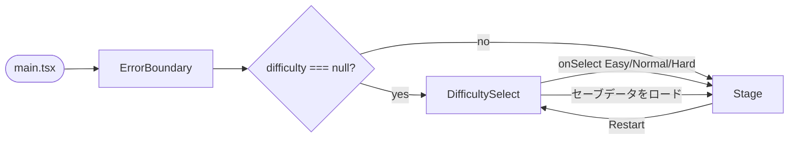
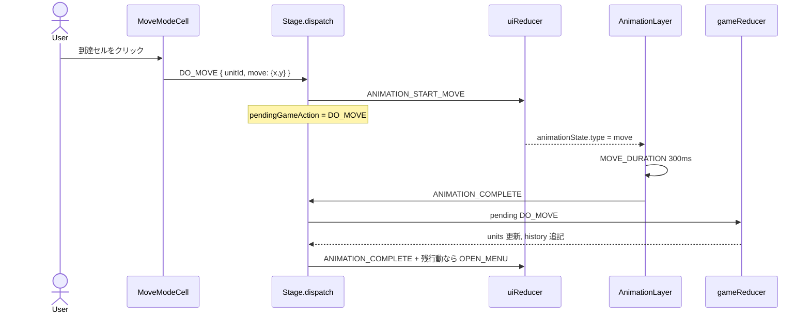
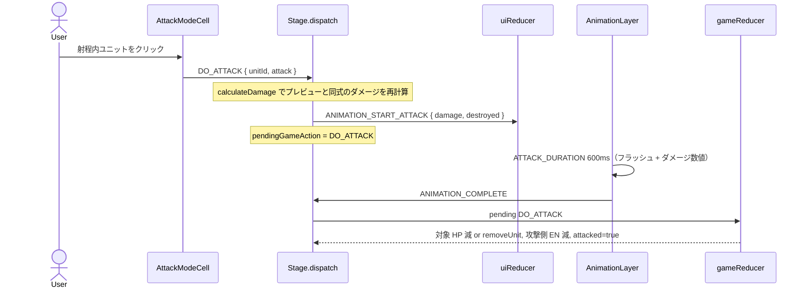
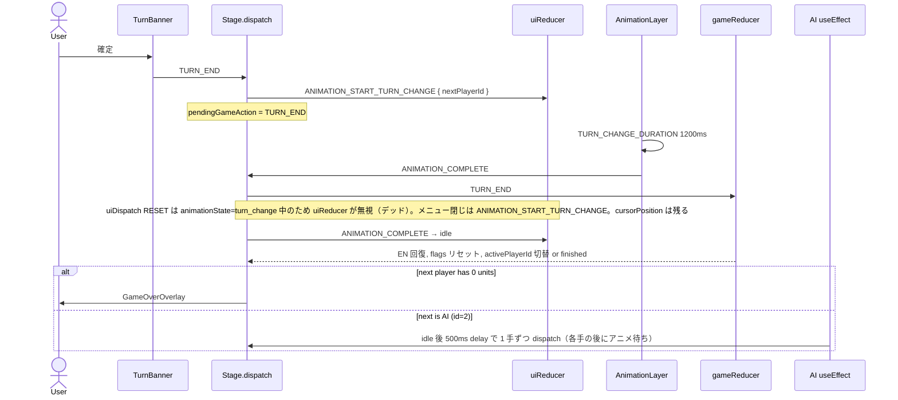
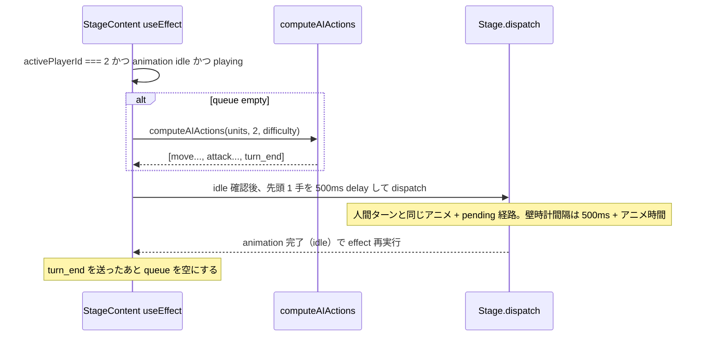

# 概要設計

| 項目 | 値 |
|------|-----|
| 文書タイトル | 概要設計 |
| Author | Engineering |
| Date | 2026-08-28 |
| Status | Approved |
| 対象リポジトリ | `war-sim-game` |
| 正本 | [as-built-design.md](./as-built-design.md) |
| 関連 | [機能要件](./functional-requirements.md) · [概要設計](./overview-design.md) · [アーキテクチャ](./architecture.md) |

本ドキュメントは現行ソースに基づく as-built 記述である。未実装機能は提案しない。

## 1. Overview

本システムは、ブラウザ上で動作するターン制の戦争シミュレーションゲームである。プレイヤー1（Hero, `id: 1`）が人間、プレイヤー2（Villan, `id: 2`, 定数 `AI_PLAYER_ID`）が AI として、13×10 グリッド上の軍事ユニットを操作し、相手の全ユニットを撃破した側が勝利する。

実装は React 18 + TypeScript strict + Vite の単一 SPA である。ゲームルールは React 非依存の純粋関数 `gameReducer`（`src/game/gameReducer.ts`）に閉じ、UI 状態は `uiReducer`（`src/pages/Stage/logics.ts`）が管理する。`src/pages/Stage/index.tsx` の `dispatch` が両 reducer とアニメーションを橋渡しする Two-Reducer パターンが中核である。ルーティングライブラリは使わず、`App.tsx` が難易度選択画面とステージ画面をローカル state で切り替える。

現行の実装済み機能は、移動/攻撃/ターン終了、地形（平地・森林・山岳・水域）、ユニット特殊能力、AI 3 難易度、セーブ/ロード（localStorage 単一スロット）、バトルログ、テキストリプレイ、戦績統計、キーボード操作、Error Boundary、GitHub Actions CI である。シナリオは `tutorialScenario` 1 本のみで、ゲームロジック層はこれを直接 import している。AI ターンのポインタロック、統計の `UNDO_MOVE` 再生、移動 BFS のユニット壁判定は部分実装または未保証である。

---


## 4. 概要設計

### 4.1 画面遷移

ルーティングライブラリは存在しない。`App` の `difficulty: AIDifficulty | null` が画面を決める。



- 新規ゲーム: `onSelect` → `setDifficulty` → `<Stage difficulty loadedState={null} />`
- ロード: `loadGame()` 成功時に `setDifficulty` + `setLoadedState` + `restartKey++`
- Restart: `difficulty=null`, `loadedState=null`, `restartKey++` で DifficultySelect へ戻る

### 4.2 ユーザー操作フロー（人間ターン）

1. 自ユニットをクリック（または Tab / サマリー）→ `OPEN_MENU` → `ActionButtons` + `UnitDetailPanel`
2. 「移動」→ `SELECT_MOVE` → 地形 BFS（経路上のユニットは壁にならない）。**空の到達セルだけ** `.cell-move-range` が付き、クリックで `DO_MOVE`。BFS 上は到達でも占有マスは通常の `CellWithUnit`（`.cell-move-range` なし、`onClick` no-op）
3. 「攻撃」→ 武装選択 `SELECT_ATTACK` → 射程ハイライト + ダメージプレビュー。対象クリックで `DO_ATTACK` → 攻撃アニメ → HP 減または削除
4. 「戻す」→ `UNDO_MOVE`（アニメなし、即 reducer）
5. 「確定」→ `TURN_END`。Enter は `cursorPosition` があるときだけセル相当。マウスでメニューを開いただけではカーソルは立たないため、その状態の Enter はメニュー表示中でも `TURN_END`

敵クリックは `INSPECT_UNIT` のみ。空セルホバーは `TerrainTooltip`。

### 4.3 モジュール責務

| モジュール | 責務 |
|------------|------|
| `src/game/gameReducer.ts` | 純粋ゲームルール。`DO_MOVE` / `DO_ATTACK` / `UNDO_MOVE` / `TURN_END` / `LOAD_STATE`。`calculateDamage` |
| `src/game/types.ts` | `GameState`, `GamePhase`, `GameAction` |
| `src/game/ai.ts` | `computeAIActions`。難易度別スコア |
| `src/game/saveLoad.ts` | localStorage 単一スロット |
| `src/game/statistics.ts` | history の独自シャドウ再生（`UNDO_MOVE` 非対応。ReplayViewer とは別経路） |
| `src/game/utils.ts` | `manhattanDistance` |
| `src/pages/Stage/logics.ts` | UI reducer。メニュー、カーソル、アニメーション状態、inspect |
| `src/pages/Stage/index.tsx` | 両 reducer の橋、キーボード、AI キュー、グリッド生成 |
| `src/pages/Stage/cellUtils.ts` | BFS 移動範囲、マンハッタン攻撃範囲、地形 CSS クラス |
| `src/scenarios/tutorial.ts` | 唯一のシナリオデータ |
| `src/constants/index.ts` | 武装、能力文言、`AI_PLAYER_ID`, `playerColor`, `assertNever` |
| `src/contexts/ScenarioContext.tsx` | UI 向け `Scenario` 供給。ゲームロジックは未使用 |
| `src/types/*` | 共有型 |

### 4.4 状態モデル

**GameState**（`src/game/types.ts`）:

```ts
{
  activePlayerId: number;
  units: UnitType[];
  phase: { type: "playing" } | { type: "finished"; winner: number };
  history: GameAction[];
  turnNumber: number;
}
```

**UI 状態 `StateActionMenuType`**（`src/types/index.ts`、`uiReducer` が更新）:

```ts
{
  isOpen: boolean;
  targetUnitId: number | null;
  activeActionOption: "MOVE" | "ATTACK" | null;
  selectedArmamentIdx: number | null;
  animationState: AnimationState; // idle | move | attack | turn_change
  inspectedUnitId: number | null;
  cursorPosition: Coordinate | null;
}
```

**Scenario**（`src/types/scenario.ts`）: `id`, `name`, `gridSize`, `players`, `units`, `terrain`。実行時は定数。

**App 状態**: `restartKey`, `difficulty`, `loadedState`。ゲームルールの外。

同一セルに 2 ユニットが乗ると `unitsCoordinates` が throw する（`Duplicate coordinates`）。占有は UI/AI 側の慣例であり、reducer の不変条件ではない。

### 4.5 シーケンス: 移動



### 4.6 シーケンス: 攻撃



攻撃後も `phase` は `playing` のままである。最後の敵を倒しても、勝敗は次の `TURN_END` まで確定しない。

### 4.7 シーケンス: ターン終了



### 4.8 シーケンス: AI ターン



AI はターン開始盤面から全ユニット分を一度に計画し、アニメ完了待ちで逐次 dispatch する。ロックはキーボードと「確定」のみ（FR-065）。`dispatch` は `AI_PLAYER_ID` を見ないため、500ms idle ギャップ中にポインタで AI ユニットの `OPEN_MENU` / `DO_MOVE` / `DO_ATTACK` が可能（FR-066）。計画キューは再計算せず、人間介入後は占有 throw または計画ずれが起き得る。

攻撃採点 quirk: `simulatedAttacker` は `!hasMoved` なら実際に `move` を積んでいなくても `moved: true` として `calculateDamage` する。強襲 +20% を見込んだスコアで武装を選び、実行時 reducer は `moved: false` のまま、という食い違いがあり得る。

占有と撃破の先読みは `occupiedCells`（着地セル） / `simulatedHp` / `destroyedUnits`。経路上のユニットは `getReachableCells` が無視する（FR-032）。

---


## 12. References

### リポジトリドキュメント

- [README.md](README.md) — セットアップ、コマンド、旧寄りの構成図
- [CLAUDE.md](CLAUDE.md) — エージェント向けアーキテクチャ要約（SVG、ファイル一覧が部分的に古い）
- [CLAUDE.local.md](CLAUDE.local.md) — ローカルタスクファイル規約（本ドキュメントの git 配置とは別）
- [IMPROVEMENT_PLAN.md](IMPROVEMENT_PLAN.md) — 完了済み機能と残存バックログ（最終更新 2026-02-19）

### 中核ソース

- `src/types/index.ts` — `DispatchAction`, `UnitType`, `AnimationState`, payloads
- `src/types/scenario.ts` — `Scenario`
- `src/game/types.ts` — `GameState`, `GameAction`, `GamePhase`
- `src/game/gameReducer.ts` — ルールと `calculateDamage`
- `src/game/ai.ts` — `computeAIActions`, `AIDifficulty`
- `src/game/saveLoad.ts` — localStorage
- `src/game/statistics.ts` — `computeStatistics`
- `src/game/utils.ts` — `manhattanDistance`
- `src/pages/Stage/index.tsx` — dispatch ブリッジ、AI、キーボード
- `src/pages/Stage/logics.ts` — `uiReducer`
- `src/pages/Stage/cellUtils.ts` — BFS / マンハッタン
- `src/scenarios/tutorial.ts` — 盤面・ユニット・地形
- `src/constants/index.ts` — 武装と能力
- `src/App.tsx`, `src/main.tsx`, `src/contexts/ScenarioContext.tsx`
- `src/components/ErrorBoundary.tsx`
- `.github/workflows/ci.yml`, `vite.config.ts`, `package.json`

### 契約としてのテスト

- `src/game/gameReducer.test.ts`
- `src/game/ai.test.ts`
- `src/game/statistics.test.ts`
- `src/pages/Stage/logics.test.ts`
- `src/pages/Stage/Stage.test.tsx`
- `src/pages/Stage/StageWin.test.tsx`

### 先行作品（計画書が参照。本 as-built の実装根拠ではない）

Fire Emblem（戦闘予測、Undo）、Advance Wars（地形防御）、Into the Breach（決定論・小型グリッド）

---

